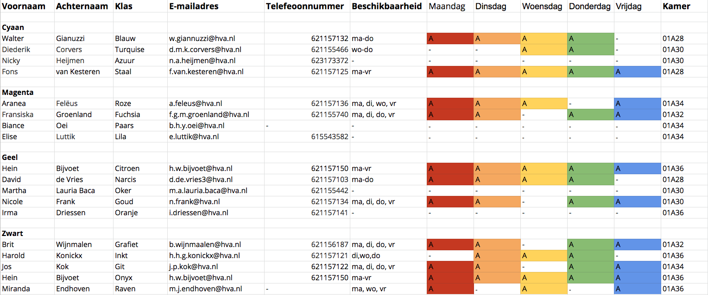

# Stakeholders

## **De stakeholders waar ik mee te maken heb:**

* **De CMD student**
  * De CMD’er die 4 jaar studeert en hard werkt om zijn of haar plekje te vinden in de digitale design wereld.
* **De SLC-er**
  * De studieloopbaan coach die de CMD’er dient te 

    ondersteunen en helpen bij zijn of haar ontwikkeling 

    tijdens de studie.
* **CMD Amsterdam**
  * Hein Bijvoet
    * SLC Coördinator en docent
      * Hein Bijvoet is SLC coördinator en heeft invloed binnen CMD om SLC tot zijn volledige potentie te ontwikkelen.
    * Aranea Felëus
      * Docent en houdt zich bezig met nieuw SLC model
* **CMD docenten en betrokken**
* Mensen bij CMD die een bepaalde functie hebben die van toepassing kan zijn in het project.
  * Harry Zengerink
    * Opleidingsmanager CMD

## CMD Studenten

* De CMD’er die 4 jaar studeert en hard werkt om zijn of haar plekje te vinden in de digitale design wereld.

## CMD Amsterdam

* De opleidingsmanager Harry Zengerink is van mening dat studieloopbaan coaching ontzettend belangrijk is voor de CMD studenten om hun zelf te ontwikkelen tot een volwassen CMD’er die startbekwaam. 
* CMD is van mening dat met een betere structuur het voor zowel studenten als docenten duidelijker wordt wat studenten aan SLC hebben en dat het makkelijker en toegankelijker wordt om in contact te komen en te blijven met hun SLC-er.

## Hein Bijvoet

SLC Coördinator Hein Bijvoet is van mening dat er zeker veel te winnen valt omtrent SLC aangezien hij graag meer CMD studenten er serieuzer mee om ziet gaan.  
****

## SLC'ers

In het eerste jaar van de CMD'er krijgt een klas een SLC-er aangewezen. Deze wordt vooral gezien als een aanspreekpunt en mentor van de klas. Het is per coach verschillend hoe ze omgaan met hun studenten en daar is op eerste gezicht niks mis mee.

Wanneer studenten in het 2e jaar hun eigen SLC-er kiezen of krijgen toegewezen ontstaan er problemen voor de student. Het is onduidelijk voor veel CMD'ers dat deze SLC-er jouw aanspreekpunt is tot het einde van je studie.

De wensen en behoefte van de SLC-er wil ik zoals eerder genoemd zo snel mogelijk in kaart brengen.  

### Propedeuse jaar \(20 SLC'ers\)

### Na het eerste jaar \(26 SLC'ers\)

