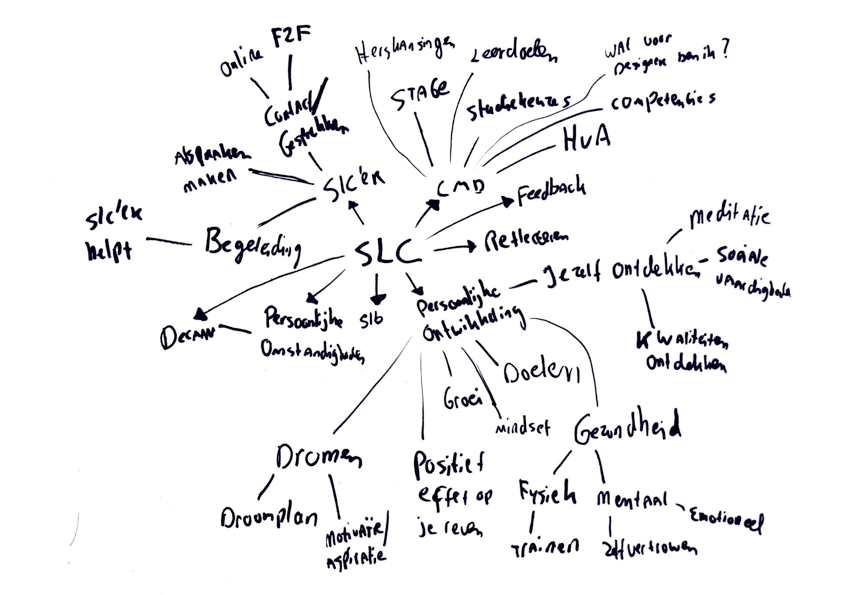
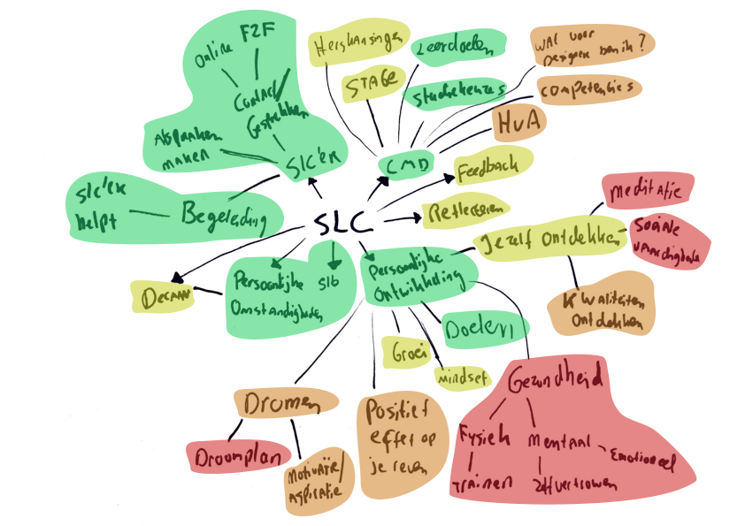
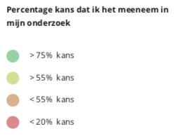

# Woordweb

Om inspiratie op te doen en te oriënteren in de beginfase van mijn afstudeerproject, heb ik een woordweb gemaakt:

Hieronder is te zien welke woorden in het woordweb naar voren zijn gekomen.De kleuren geven aan hoe groot de kans is waar ik mijn focus op ga leggen tijdens mijn onderzoek.Hieruit nam ik de groen en gele onderwerpen mee om verder te onderzoeken in de vorm van desk research.

