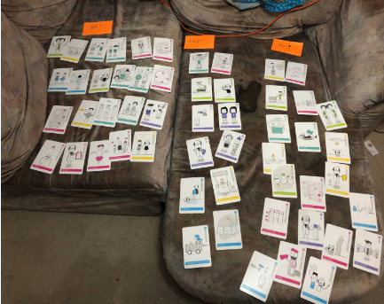

# Methodes

**Ja! \(Er is een grote kans dat ik deze methode toepas in mijn afstudeertraject\)**

Field trail

Empathy map

Moodboard

Customer Journey

Context mapping

Focus group

Survey

Participant observation

Card sorting

Scamper

Orienting expert interview

Peer review

Benchmark Creation

Interview

Co creation

Ideation

Design specification

Prototype

Test report

Task Analysis

Requirement list

Co-reflection

Showroom

Best, good and bad practices

Pitch  

**Twijfel? \(De volgende methodes zijn onzeker en heeft meer aanleiding nodig om eventueel toe te kunnen passen\)**

Heuristic evaluation

Expo

Wizard of OZ

A/B Testing

Prototyping

Sketching

Storytelling

Usability testing

Thinking aloud

Trend analysis

Literature study

Fly on the wall

Persona  
****

**Nee! \(De volgende methodes hebben een kleine kans om gebruikt te gaan worden in mijn afstudeertraject.\)**

Scenario

Biometrics

Comparison chart

Inspiration wall

USP

Cultural probes

Design pattern search

Proof of concept

Risk analysis

Online analytics

Morphological chart

Product Quality review

Provocative prototyping

Diary study

Competitive analysis

Concept

Business model canvas  
****

**-**

**Ik heb voor nu 3 methodes uitgelicht:**  

**Focus group**

Bij een Focus group bespreek je met een groep van 5 tot 10 mensen een bepaald onderwerp of prototype voor ongeveer 45 - 90 minuten. Hieruit kunnen er ontzettend veel inzichten tegelijk komen. Het is efficiënt om meerdere meningen, ervaringen en kennis in 1 sessie in een groep te bespreken.  

Dit lijkt me daarom dus een goede methode. Ik zou deze methode graag 2x willen toepassen. Eerst met studenten en daarna met docenten. In totaal hoop ik meer dan 15 mensen gesproken te hebben. Hieruit zullen inzichten voortkomen met betrekking tot SLC.  
****

**Co-creation**

Door samen met de gebruikers \(studenten en docenten\) na te denken over het concept en de digital probleemoplossing kan je ervoor zorgen dat het eindproduct beter past bij de gebruikers. Daarnaast scheelt het enorm veel tijd omdat je de gebruikers betrek bij het ontwerpproces.

Dit wil ik doen door middel van workshops met verschillende oefeningen om duidelijk te krijgen wat de huidige probleemsituatie is.  
****

**Peer review**

Door feedback te krijgen van klasgenoten en docenten, zorg ik ervoor dat ik goede experts tot mijn beschikking hebt om goed onderzoek mee te doen. Ik ken genoeg CMD’ers die het probleem kennen en ik ben benieuwd naar hun bevinden en gedachten. Deze kan ik dan meenemen in het ontwerpproces. Door een vergadering of workshop of een bijeenkomst te organiseren, zorg je ervoor dat het voor mijn peers makkelijk wordt om feedback te geven en mee te denken.  

