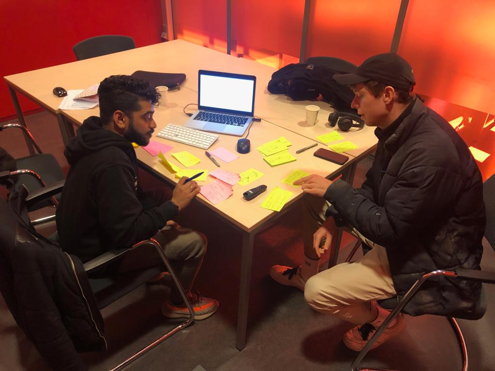

# Daan Rongen

Maandag 15 april

## Feedback presentatie

* Heldere presentatie
* Definieer SLC'er en de relatie met de student uit in je presentatie
  * Meer van de context vertellen
* Vertel wat SLC voor waarde had op jouw loopbaan
* Leg beter uit waarom het niet erg is dat mensen altijd problemen zullen hebben
* Design challenge 4.0 is al beter maar kijk of je een iteratie kan doen op "zo verloopt"
  * Het bestaansrecht of de oplossing mist nog in de DC. Welk probleem wordt er opgelost?
* Pas op dat het geen SLC'er on demand wordt
* Het gemakkelijker maken van vragen stellen, is dat de oplossing?
* Gelijke kansen voor studenten is sterk!
  * Maar complex en er zijn veel factoren waar je rekening mee moet houden

## Feedback/opmerkingen concept

* SLC voelt op dit moment aan als een uiting wat de "worst of both worlds" namelijk de vak instelling en houding van de coach.
* Maak je UPS's helder van de oplossing
  * De features van je product
    * De persoonlijke doelen koppelen met gebruikersdoelen 
* Maak het multimedia
  * Multimediaal 
    * DMV branding awareness
      * \#IkDoeMeeMetSLC
    * CMD heeft al best een toegankelijke, open/diverse/inclusieve cultuur
      * Maak hier gebruik van.
  * Extra dimensie toevoegen laat zien hoe vruchtbaar je afstudeerproject is
  * Kan zorgen voor extra triggers van meerdere stakeholders
* Het is interessant om te onderzoeken hoe je studenten effectief kan betrekken
* Waarom hebben studenten überhaupt een coach? Waar ligt de oorsprong?
* Een decaan heeft 2 voordelen t.a.v een SLC'er
  * Geheimhoudingsplicht
  * "Macht"
* Wat is je product maar wat is het vooral niet?
* Studenten hebben voorkeuren voor SLC'ers
  * Hoe kan je dit verwerken in je product?

## Next steps

* Kijk naar de HEMA voor een inclusieve branding
* Doe eens lief campagne
  * [RTL Nieuws](https://www.rtlnieuws.nl/nieuws/nederland/artikel/4629891/campagne-moet-huftergedrag-verminderen-doe-eens-lief-doeslief)
* Train etiquette simple stuff
  * Branding/awareness \(let op de memes\)
* SLC Branding
  * Posters in de media lounge
* Onderzoek [LAS studie op de universiteit in Utrecht](https://students.uu.nl/gw/las/praktische-zaken/begeleiding-en-advies) op gebied van optimaal les geven en persoonlijke groei.
* Waar ligt de orgin van coaches
* Onderzoek naar [http://www.carrieretijger.nl/functioneren/ontwikkelen/didactische-vaardigheden](http://www.carrieretijger.nl/functioneren/ontwikkelen/didactische-vaardigheden)

