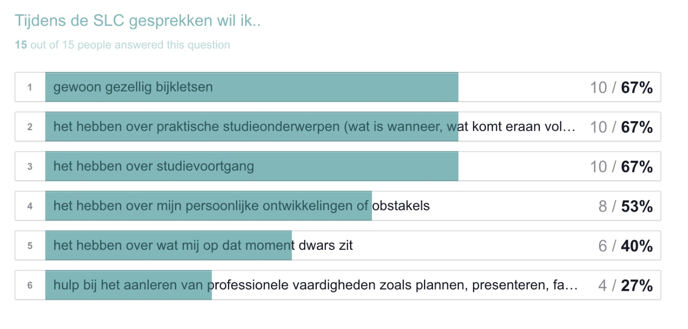
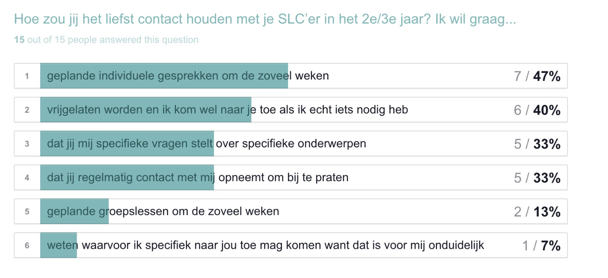

# Linda Trap

## Co-Creatie

Op dinsdag 2 april heb ik een co-creatie gehouden met Linda Trap. Zij is een docente op CMD die les geeft aan 2e en 3e jaars studenten. Naast haar rol als docente is ze ook SLC'er. Ze staat graag klaar voor haar studenten en investeert maar al te graag tijd & energie in SLC. Zo heeft ze recent \(maart, 2019\) haar eigen onderzoek gedaan op haar SLC studenten \( 15, 2e en 3e jaars CMD studenten\) :

Hieruit kunnen we concluderen dat "gezellig bijkletsen", "praktische studieonderwerpen" en "studievoortgang van de student" de belangrijkste onderwerpen zijn tijdens het SLC gesprek. Dit is interessant aangezien ik ook kan bevestigen uit mijn [interviews](https://afstuderen.armandbissesar.com/~/edit/drafts/-LbY2qs8ozHc8jZz6uSE/verkenningsfase-1/interviews) dat studenten het inderdaad fijn vinden om met hun SLC'er het te hebben over deze onderwerpen.

Wat opvalt is dat er een groep studenten zijn die de verantwoordelijkheid meer bij de SLC legt en dat er een groep is waar ze graag zelf meer over de verantwoordelijkheid beschikken. In mijn product zou het dus zomaar kunnen dat de student zelf bepaald tot hoe vaak de SLC'er contact opneemt met de student.

## Verder inzichten

### Het probleem

* Voor Linda is het duidelijk dat het probleem is dat:
  * Studenten geen of weinig contact opnemen.
    * Dit is een probleem omdat studenten persoonlijke omstandigheden/schoolzaken voor hun zelf houden terwijl het negatieve gevolgen heeft op hun school.

### Functies

* De functie om studenten vragen/opmerkingen door te sturen naar een relevantere persoon voor de vraag, werd goed ontvangen door Linda. \[Soort doorgeefluik?\] Wel vond ze het belangrijk om aan te geven of de student mag zien of de vraag is doorgestuurd \(CC/BCC\). De studenten moeten niet het idee krijgen dat ze van het kastje naar de muur worden gestuurd! 
* Een back-up SLC'er/docent voor elke docent. Wanneer de student zijn of haar een bericht stuurt dan is dat een signaal van aandacht. Deze moeten ze dan ook krijgen. Het zou kunnen dat een docent niet kan reageren ivm afwezig voor een dag of langere tijd, dan zou het bericht automatisch kunnen worden doorgestuurd naar de back-up SLC'er.
  * Het kan ook gezien worden als een soort controle vanuit het management. 
* Matching van Student en SLC'er zou kunnen o.b.v voorkeurstermen die de student kan sorteren o.b.v wat hij/zij belangrijker vindt in het jaar:
  * Algemene studievoortgang
  * Persoonlijke ontwikkeling
  * Minoren/vakken
  * Herkansen
  * Stage 
  * Praktijkervaring/ondernemerschap 
* Studenten kunnen aangeven hoevaak per periode, de SLC'er contact zou moeten zoeken bij de student.  \(Het is lastig om in te schatten of dit goed aangeeft of een student diep van binnen eigenlijk meer contact wilt maar dit lastig vind\) 
* SLC docenten van het 2e jaar vragen altijd aan de SLC'ers van de 1e jaren, hoe het eerste jaar verliep van de student. In de overdracht krijgt de SLC'er van het eerste de mogelijkheid om eventuele omstandigheden te delen met de aankomende SLC'er.
  * Dit verschilt nogal tussen SLC'ers hoe hier mee wordt omgegaan.
    * Digitaal valt hier zeker wat te winnen.
      * Digitale overdracht waarde door de studiejaren heen naast het gesprek van de SLC'ers

### SLC

* Mocht de nieuwe SLC structuur doorgaan, dan kan dat ervoor zorgen dat de studenten meer of minder tijd nodig hebben bij een adviseur, begeleider of coach.  
* Het is interessant om te kijken of het product goed past met de beschikbare uren van de SLC'ers 
* "Hoe kan je ervoor zorgen dat docenten de meerwaarde van het product inzien en dat het product voor hun tijdbesparend is?"

### Programma van Eisen 

* Het product moet vrijblijvend gebruikt kunnen worden door zowel de SLC'er als student

* Een sterke basis aan gegevens die de docent en student minimaal moeten invoeren om het product goed zijn ding te laten doen, namelijk de communicatie drempel laag houden en de brug verstevigen tussen beide partijen.

  * Extra opties geven om het systeem te personaliseren voor het gemakt voor zowel studenten als SLC'ers.

* Linda heeft haar eigen systeem \(Excel\) gecreëerd om bij te houden, hoe het gaat met de studenten. Hierin komen de volgende onderwerpen aanbod:
  * Heeft de student zijn of haar P gehaald?
  * Stagestatus
  * Studievoortgang
  * Herkansingen
  * Persoonlijke omstandigheden
  * Zitten ze met iets? 
* Linda vind het fijn om haar studenten face 2 face te spreken. Zo weet ze beter hoe het met hun gaat.

### AVG

* Docenten zijn objectiever in het kiezen van de studenten dan andersom. 
* Houd rekening met de gegevens die de student kan en mag zien.

### Nader te onderzoeken

* Interessant maar geen prio:

  * Bekijk het interactiemodel; de Roos van Leary
  * Matching systeem is meer iets voor de toekomst misschien

* Kernkwadrant Daniel Ofman;
  * Om meer inzicht in deze onderlinge verhoudingen te krijgen, ontwikkelde [Daniel Ofman](https://www.toolshero.nl/bekende-auteurs/daniel-ofman/) een kernkwadrant / kernkwadranten waarin duidelijk wordt waarom die wrijving ontstaat.   Bronvermelding: \([https://www.toolshero.nl/communicatie-modellen/kernkwadrant-ofman-theorie/](https://www.toolshero.nl/communicatie-modellen/kernkwadrant-ofman-theorie/)\)
  * Interessant om te onderzoeken 
* "Wat vet zou zijn is als je studenten en SLC'ers zou kunnen koppelen o.b.v leerstijlen:
  * Emotioneel
  * Praktisch
  * Zakelijk
  * Etc.

