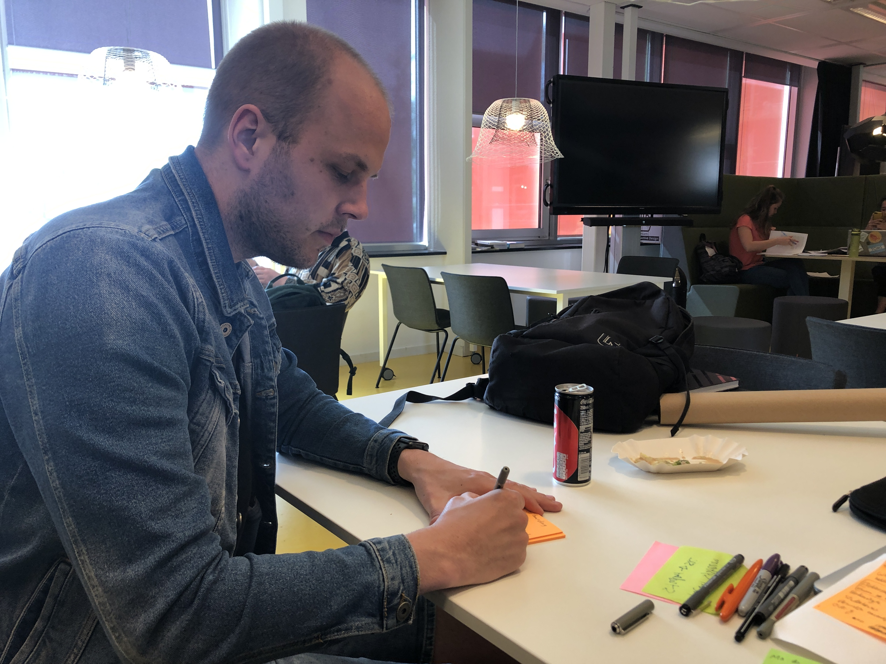
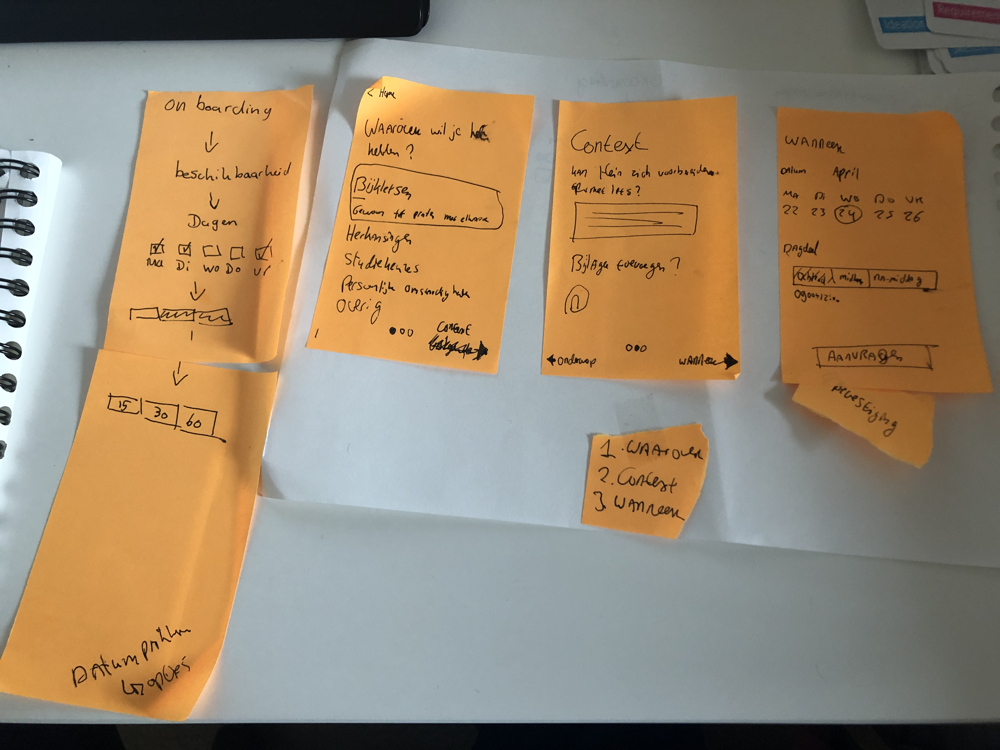
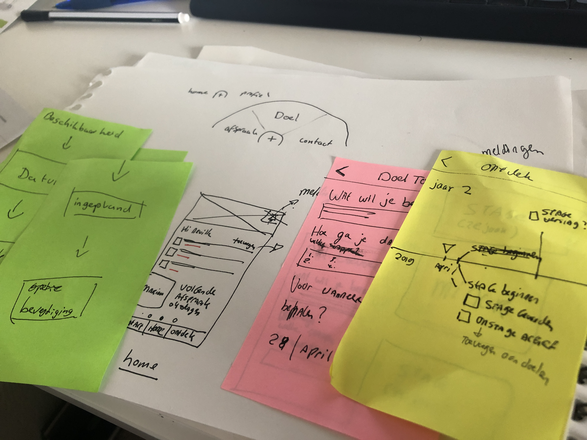

# Niels van der Leeuw

## Inzichten

* Vanaf elke scherm terecht kunnen bij elke functie van de app

  * [https://material.io/design/components/buttons-floating-action-button.html](https://material.io/design/components/buttons-floating-action-button.html#)

* Samen werken aan "afspraken maken"
  * Denk aan soort van datumprikker
* Rood bolletje bij een actie/update van een student/SLC'er
* Studenten stellen waardevollere vragen als ze beter weten wat ze kunnen doen en makkelijk hun vraag kunnen stellen
* Hulp bij simpelere vragen
* Afspraken maken met je SLC'ers met de juiste context heeft meer waarde voor beide partijen ten opzichte van een chat.
  * Een chat heeft veel meer concurrentie.
  * Het zorgt ervoor dat de SLC'er een extra platform om te bekijken
  * Een chat is geen garantie op waardevollere gesprekken./

