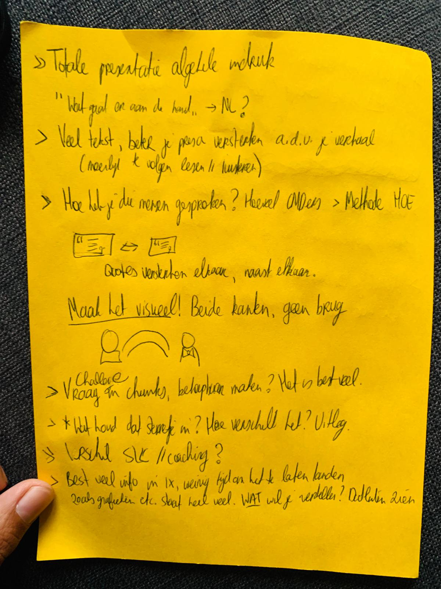
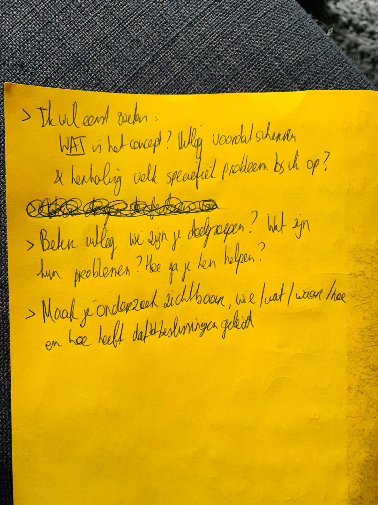

# Pinar Kesenci \(Jungle Minds\)

Donderdag 2 Mei 2019 \| Google Hangouts

## Feedback presentatie/concept

* "Je verhaal is goed! Het is duidelijk dat je veel onderzoek hebt gedaan en dat vertel je goed!"
* "Je gebruikt nogal veel tekst en dat werkt verwarrend. Ik weet niet goed of ik moet luisteren of lezen. Door meer tekst te visualiseren of op te breken kan je veel beter je sterke verhaal versterken en nog beter over laten komen."
* "Breek je DC bijvoorbeeld op en ligt de punten van de DC uit"
* "Je veel mensen gesproken maar laat ze ook zien!"
  * Gebruik lekker veel foto's en leg uit hoe je onderzoek hebt gedaan.
* "De quote van Rick en Hein koppelen met elkaar zodat ze elkaar vergelijken"
  * Zet ze bijv naast elkaar.
* "Visualiseer de brug die niet stevig genoeg is tussen de SLC'er en student."
* "Sta nog even stil bij je doelgroep dmv een slide."
  * 1 visualisatie neemt mensen al beter mee in het verhaal.
* "Slide 20 \(Survey SLC'er\)
  * Maak duidelijk wat je met die cijfers wilt duidelijk maken
* "Voordat je de schermen laat zien, vertel meer over je concept en waarom dit het concept is"
  * Vertel waarom het studenten en slc'ers ondersteunt
    * Vertel over de problemen en waarom deze features die problemen tegen gaan.
      * Laat de verbanden zien
* Het is niet erg om in herhaling te vallen.
  * Zo kan je dingen zoals je DC alleen maar verduidelijken.
* Maak je onderzoek lekker zichtbaar in je presentatie.
* Wees consistent in je manier van presenteren van schermen.
  * Kan zorgen voor verwarring.
* PvE/Design principes/waardes opstellen om je concept te valideren.
* Wat als je meerdere onderwerpen wilt selecteren bij afspraken pagina?

