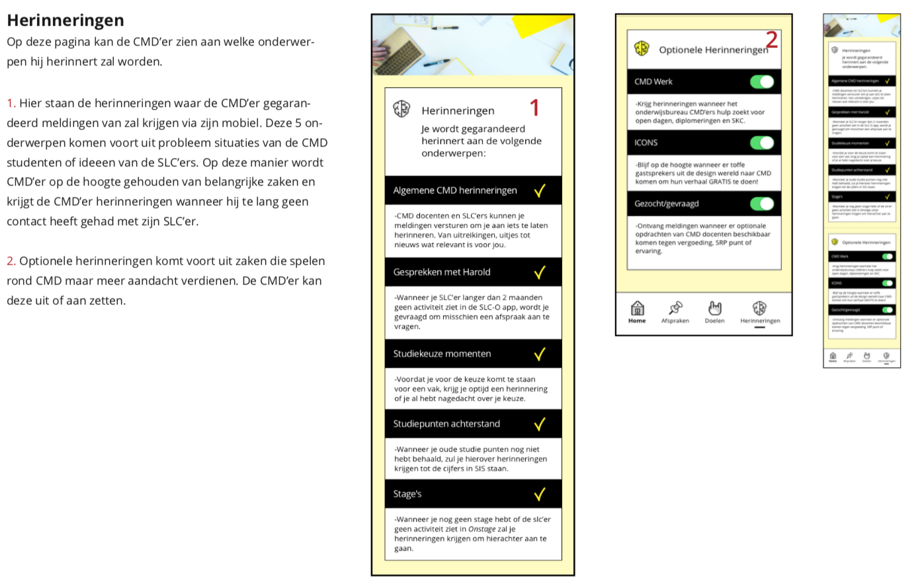

# SLC-O \(CMD'er versie\)

## Versie 1

### Onboarding

### Schermen

## Versie 2


_Klik op de afbeeldingen om ze uit te vergroten_


### Onboarding

* De gebruiker kan inloggen met zijn of haar HvA ID. Wanneer dit niet mogelijk is kan de gebruiker klikken op “ik kan niet inloggen”. De gebruiker komt dan op de wachtwoord vergeten pagina van de HvA. 
* Je HvA ID is essentieel omdat alle data in databases worden opgeslagen die gekoppeld zijn met je HvA gegevens. Ik heb hiervoor gekozen omdat de student en docent hierdoor alle relevante gegevens ter beschikking heeft om een succesvolle studieloopbaan tegemoet te gaan. Alles op 1 plek zorgt voor duidelijkheid. Nadat je 1x hebt ingelogd hoe je niet meer in te loggen op de app versie.

### 
 Homescherm 

### Doelen

### Mijn SlC'er

### Gesprek aanvragen \(onderwerp\)

### Gesprek aanvragen \(context\)

### Gesprek aanvragen \(datum\)

## Versie 3


_Klik op de afbeeldingen om ze uit te vergroten_


### Onboarding

### Home 

### Home \(State; Afspraak aanvragen\)

### Mijn SLC'er pagina

### Herinneringen

### Doelen

### Doelen toevoegen

### Doelen \(aanbevolen\) toevoegen

### Afspraak pagina

### Afspraak aanvragen \(Onderwerp kiezen\)

### Afspraak aanvragen \(Tijdsduur kiezen\)

### Afspraak aanvragen \(Tijdsduur kiezen\)

