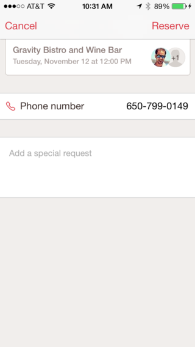

# Design Pattern Research

User Flows Inspiratie



## Onboarding/Next step

* **Annotated** — Overlayed product commentary.
* **Embedded** — Co-mingled with the actual product experience.
* **Dedicated** — Isolated and distraction-free.

Bronvermelding: [https://www.appcues.com/blog/choosing-the-right-onboarding-ux-pattern](https://www.appcues.com/blog/choosing-the-right-onboarding-ux-pattern)



### Yahoo News Digest

### Google Docs

## Tijd en datum

### [Handy](http://uxarchive.com/apps/handy)

### [Perfect date pick medium](https://uxdesign.cc/date-picker-design-5c5ef8f35286)

## Input field 

### [OpenTable](http://uxarchive.com/apps/opentable)

## File upload

### [Pinterest](https://nl.pinterest.com/pin/71072500348992325/)

### [Inspiratie Medium](https://medium.muz.li/file-upload-ui-inspiration-a82949ed191b)

## [Booking tool](http://uxarchive.com/tasks/booking)

## [Navigatie](https://mobile-patterns.com/navigation)

### [Inspiratie medium](https://uxplanet.org/5-ui-patterns-navigation-that-makes-good-ux-sense-92a65df7485d)

### [Top 8 medium mobile navigation](https://medium.com/@soulless/top-8-mobile-navigation-menu-design-for-your-inspiration-8a2d925bffc0)

## Drop down menus



* Heel handig om te navigeren tussen elk CMD Jaar

## Chat use in app/website

[https://whatshelp.io/widget](https://whatshelp.io/widget)

