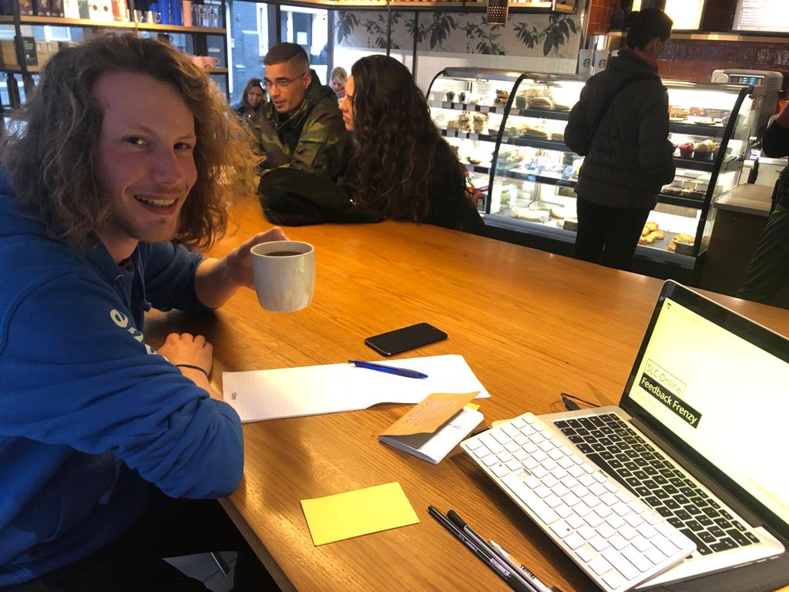
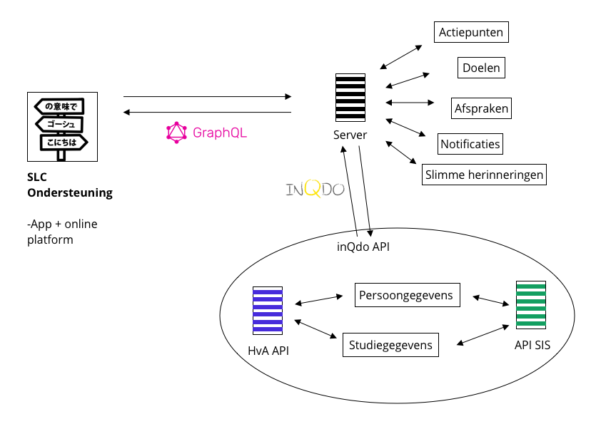

# Rick Lancee \| Lifely

Gesprek 30 April 2019

## Rick's Notities

* Examencommissie betrekken als een soort gezag van de SLC'ers
* Wat als een student geen doelen heeft of kan in vullen?
* Hoe maak je die doelen?
  * Misschien op basis van een stappenplan \[templates\]

## Rick's feedback

### Eerste gedachtes

* "Ik heb zelf het probleem meegemaakt dat ik uit het oog ben verloren en niemand vanuit CMD die dat opmerkte." Rick ging zijn eigen weg maar dat hij niet alleen hoeven doen.
  * Kreeg 1 mailtje van de SLC'er die verstuurd naar zijn SLC groep en niet persoonlijk overkwam.
* Dit concept en probleem is sterk omdat vooral focus op 1 op 1 aandacht van zowel de student als SLC'er.
* Doelen kunnen opstellen dmv suggestie in welk jaar de student zit of templates 
* "Brug van zelfstandigheid.." slide 7 \(presentatie\) goed omzetten naar een lekker lopende zin
  * Visueel maken is een goed idee
  * Laat iemand kijken naar de manier van woorden over brengen
    * Misschien Hein? 
* De studenten overview bij de slc'er zou het beste kunnen werken op basis van aandacht/urgentie levels. Daarmee kan je het makkelijker maken voor de SLC'er om eerder te vragen hoe het gaat met iemand.
  * Dit zou je later kunnen uitbreiden met machine learning en slimme AI.
  * Het werkt goed om processen tussen de communicatie van de student en SLC'er weg te halen. Zo kan de SLC'er de student niet meer uit het oog verliezen.
  * Je zou de aandacht/urgentie levels kunnen koppelen aan de status van de student.
    * Stel dat de student net met zijn stage is begonnen en zijn stageplan heeft ingeleverd, dan zou de student lekker zijn stage kunnen lopen en heeft hij waarschijnlijk minder behoefte aan een gesprekje. De SLC'er kan dan zijn of haar focus op studenten zetten die het dan net iets meer nodig hebben.
* Een soort actielijst voor SLC'ers
* "Wat moet ik regelenen module voor studenten"
  * Studenten helpen met data die al bekend is
    * Minorenmarkt
    * Stage zoeken 
    * Portfolio maken
* De actiepunten/afspraken met context zorgen voor gesprekstof en is daarom beter dan een chat systeem.

### Technisch verhaal

* Het concept is technisch haalbaar
* [inQdo](https://www.inqdo.com/) connect zorgt ervoor dat alle systemen elkaar verbinden.
  * Via de inQdo API worden de gegevens van de HvA opgehaald in de huidige HvA app.
    * Meer info over [inQdo connect](https://www.inqdo.com/inqdo-connect/) hier te lezen. 
* Dit is zeer relevant voor mijn project
* Authorizatie en persoonsgegevens komen van de HvA API
* [Graphql](https://graphql.org/learn/)
  * Snel
  * Klein in MB
  * Makkelijk om met meerdere externe diensten te koppelen
  * [Meer info](https://nljug.org/java-magazine/graphql/)
* React Native
  * Crossplatform
  * Easy to build
    * Zie HvA app
* Alternatief Progressive Web App
  * Duurt langer, makkelijker voor web based.
    * Meer werk om te maken
    * Offline service workers is complexe technologie
    * Het is makkelijker voor web only based platformen met een altijd online network connection \(MVP\)

### Technische tekening

### Next steps

* MVP maken
* Toekomst plannen helder maken
  * Hoe kunnen de volgende versies eruit zien?
* SLABC implementeren in concept en vertellen/pitchen aan CMD
  * "Mijn project raakt de raakvlakken van het nieuwe SLC"
* Offerte vragen aan Lifely
  * Project past goed bij Lifely omdat ze al ervaring met de HvA app en het valt onder de klanten waar ze mee willen samenwerken.
    * Ervaring met de AVG
* Een roadmap maken van de app; Wat is de toekomstvisie?.

