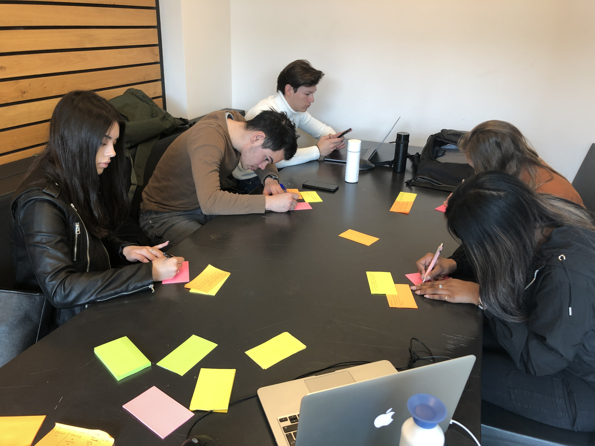
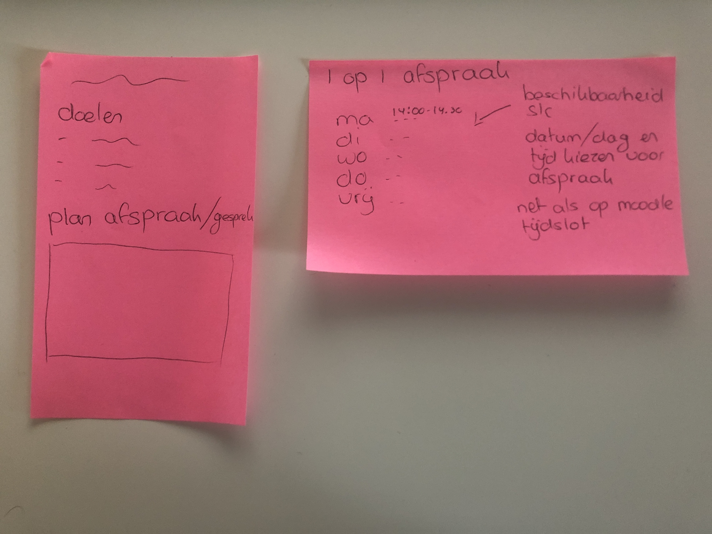
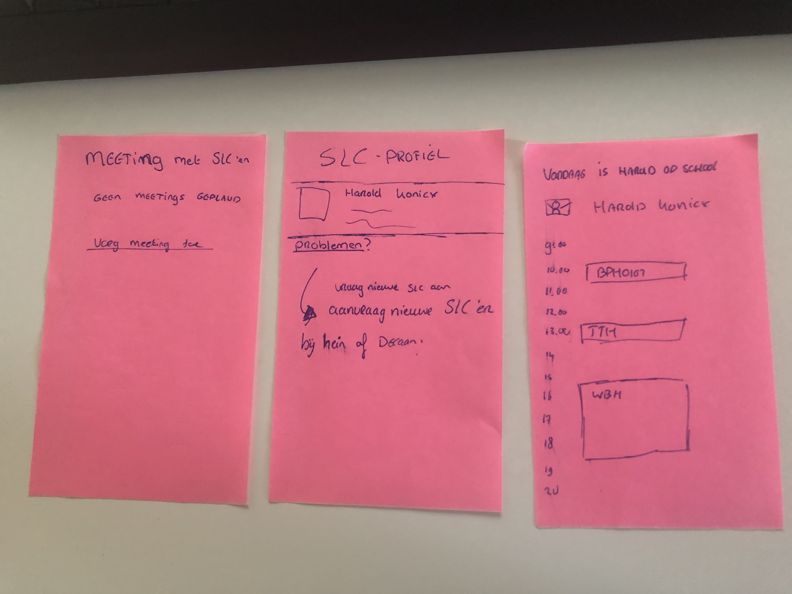
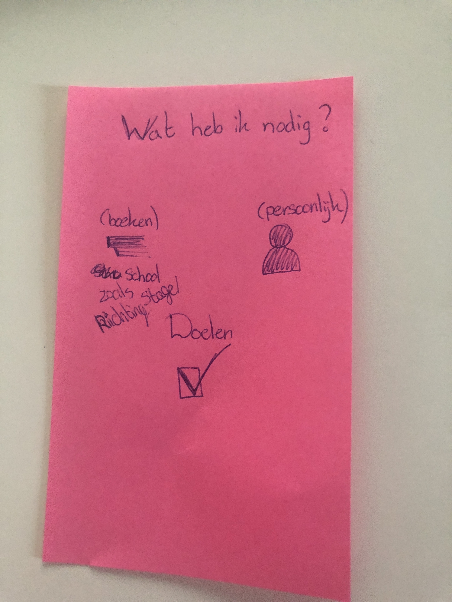
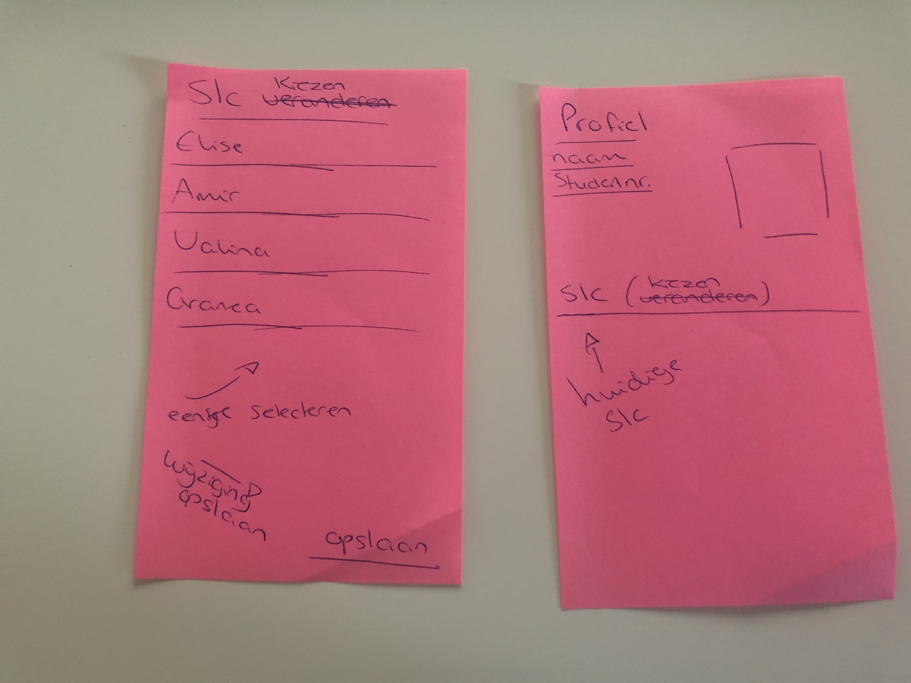

# Klas Lila

Maandag 15 april

## Jorinda

### Wat is SLC voor jou?

* De mogelijkheid om met je SLC'er te praten over hoe je ervoor staat en waar je mee kan praten over je portfolio.

### Feedback idee

* Goed idee om SLC meer persoonlijk te maken
* Wat als je geen band hebt met je SLC'er, kan je dan wisselen?
* Afspraken maken lijkt me heel handig

### Schets/idee/uitwerking van het product

* Afspraken maken 
* Tijdslots net als moodle

## Jordy

### Wat is SLC voor jou?

* SLC houdt voor mij in dat een SLC'er een begeleidende rol heeft tijdens je schooljaar en waar je bij terecht kan als er iets is.

### Feedback idee

* Goed concept
* Iets meer kleurgebruik?
* Wat als je van coach wilt wisselen?
* Rooster van docenten laten zien?
* Hoe krijg of wordt aan mij een SLC'er toegewezen?

### Schets/idee/uitwerking van het product

* De beschikbaarheid zien van de SLC'er

## Veerle

### Wat is SLC voor jou?

* SLC is voor mij een uur waarin besproken wordt hoe het afgelopen blok is gegaan en hoe het aankomende blok eruit gaat zien.
* Daarnaast wordt er gekeken naar je studievoortgang

### Feedback idee

* Het zou zeker fijn zijn als er een systeem is waarbij je ziet of een docent aanwezig is.
* Zou ook zeker helpen als je dezelfde SLC'er 4 jaar lang hebt.
* Drempel wordt op deze manier zeker laagdrempelig gemaakt 

### Schets/idee/uitwerking van het product

* Benodigheden ter voorbereiding van een gesprek voor een student

## Sharon

### Wat is SLC voor jou?

* Informatie krijgen over de opleiding en wat er gedaan moet worden om het jaar/blok te halen

### Feedback idee

* Handig om te zien waar je SLC'er is en of hij online is
* Automatisch antwoord geven is heel handig

### Schets/idee/uitwerking van het product

* SLC veranderen

## Algemene punten

* Ideale verwachtingslijn 2e jaar onderzoeken
* Hoe zou je een andere SLC'er kunnen aanvragen?
* Fijn systeem

