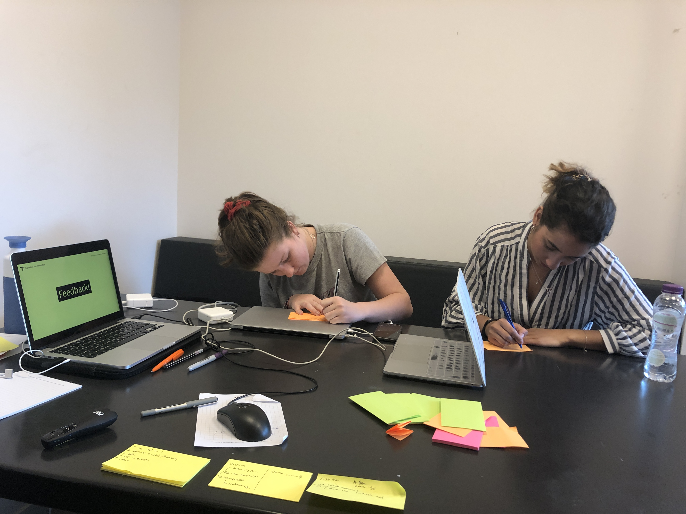
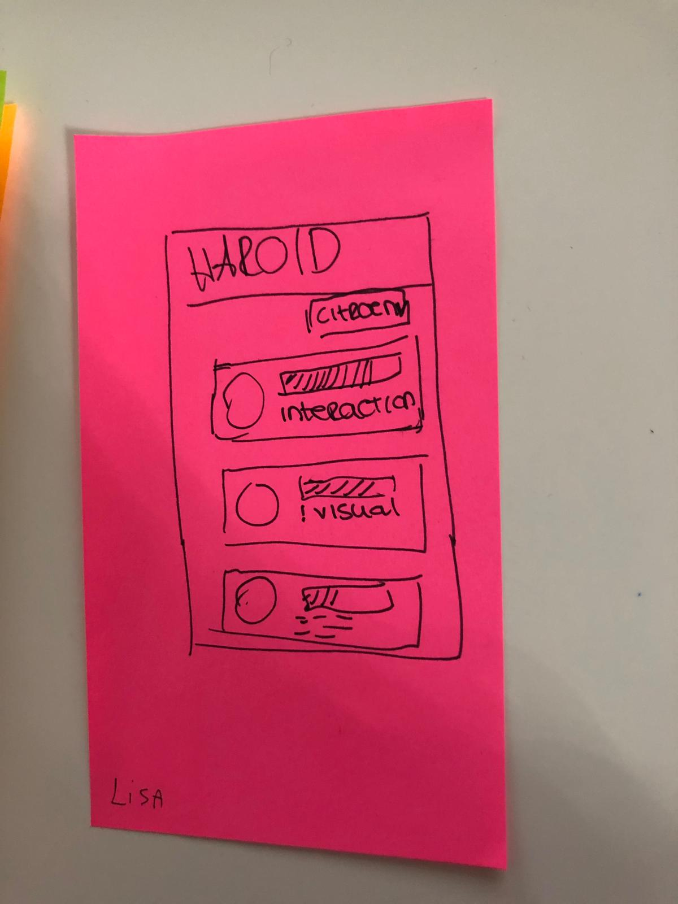
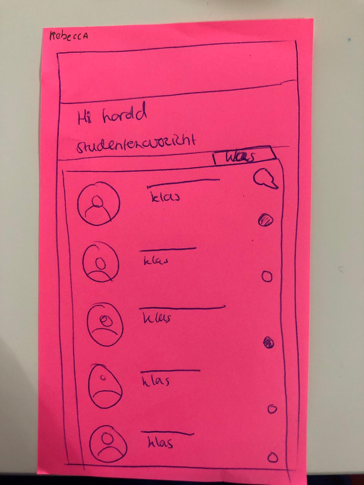

# Lisa & Rebecca

Woensdag 17 April 2019

## Lisa \| Algemene feedback punten

### Feedback op concept en presentatie

* Goed concept!
  * Tof dat de docent overzicht krijgt in waar de student nu meebezig is 
* Zou niet zo snel via de app chatten, eerder whatsappen omdat ik dit nu toch al doe met Hein
  * Dus dan is chatten overbodig naar mijn mening

### Schets/idee/uitwerking van het product

* Filter systeem obv klassen of groepen
* De SLC'er kan zien wie zijn studenten zijn, welk project ze doen en hoe hun studievoortgang is \(dmv aantal studiepunten\)

## Rebecca Hutubessy \| Algemene feedback punten

### Feedback op concept en presentatie

* Tips:
  * In de applicatie zou ik meer denken over wat de student zou willen in de vorm van functies of mogelijkheden om de student te helpen. Meer redenen om het als student te willen gebruiken.
* Tops:
  * Goed en duidelijk gepresenteerd. Heel goed concept en denk dat het heel nuttig kan zijn voor zowel de SLC'er als student.

### Schets/idee/uitwerking van het product

* Filtering op klas, groepen, naam 
* Via studentenoverzicht naar chat berichten gaan
* Je kan zien wie online is en wie niet
* Sorteren op basis van aantal keer contact

## Armand's aantekeningen

* Lisa en Rebecca maken af en toe gebruik van twee slc'ers  
* Jos reageert snel op mail en dat is fijn. 
* Whatsapp werkt inderdaad makkelijk en laagdrempelig.
  * "Ik ben niet zo van het bellen en mail is weer zo formeel. Whatsapp komt dan gewoon beter uit" -Rebecca 
* Het tweede jaar zou zich meer kunnen focussen op individuele gesprekken en niet zozeer de klas. Dan kan je mensen uit het oog verliezen. 
* Wanneer er in mijn persoonlijke situatie iets gebeurd wat invloed heeft op mijn school, dan ga ik naar decaan.
  * Door de volgende redenen:
    * Decaan komt meer over als een vertrouwenspersoon
    * Het is een vrouw en daar voel ik me prettiger bij als vrouw.
    * De SLC'er zie ik meer als iemand om af en toe bij te kletsen 
* Face2Face contact is chiller dan online communicatie  
* Het eerste jaar is meer informatievoorziening en bij praten. Niet echt persoonlijke ontwikkeling.

