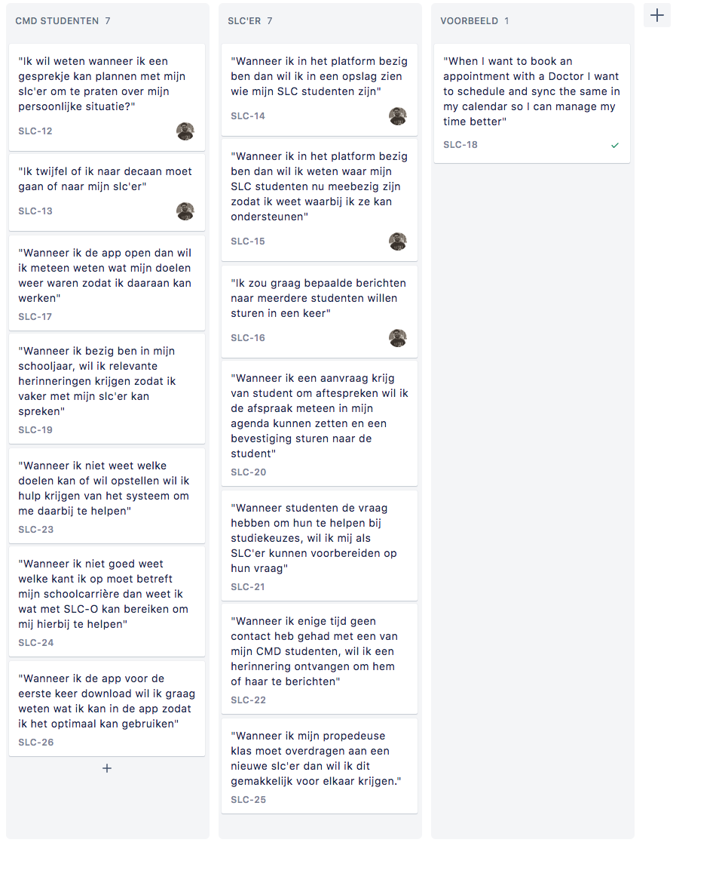

# Job stories

**Job stories**

Nadat ik mijn PvE had geüpdatet, besloot ik om job stories te maken. Een job story is een sterke manier om functies of doelen in je applicatie een context te geven. Deze kan je dan valideren met je digitaal product. Zo denk je na in de context van de gebruikers en houd je overzicht over de belangrijkste functies.

Hieronder staat hoe een job story wordt geformuleerd:

Na het formuleren van de job stories, was het nodig om mijn design challenge te updaten.

