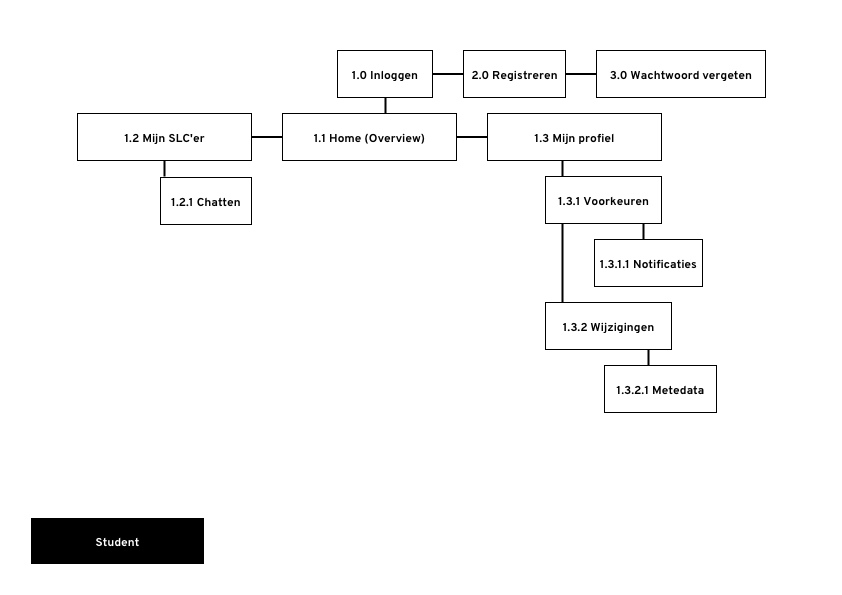
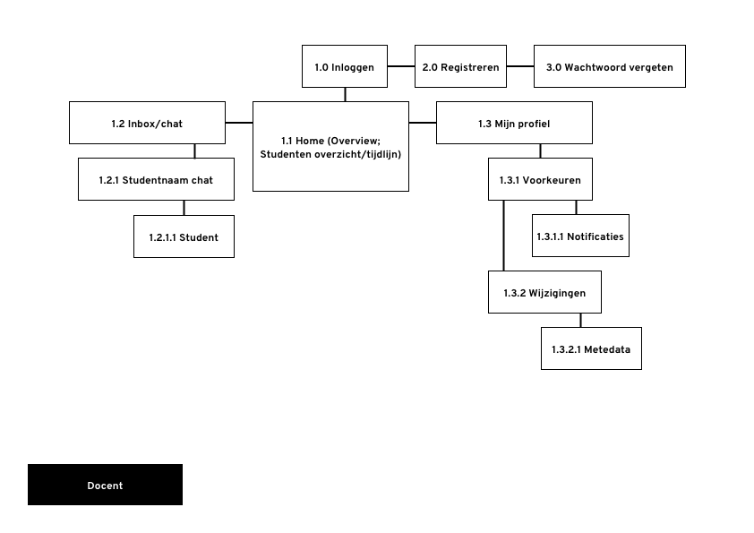
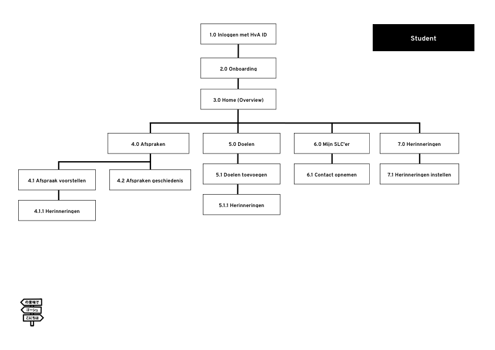

# Card sorting & Informatie Architectuur

## Wat is Card Sorting?

Card sorting wordt toepast om een duidelijke navigatie structuur in te richten voor een website of ander digitaal product. Dit wordt gedaan vanuit het oogpunt van de gebruikers om zo tot een logisch informatie architectuur te komen.

Door een goede navigatiestructuur geef je jouw product een stevig skelet waar de gebruiker makkelijk op kan teren wanneer hij of zij jouw digitaal product gebruikt.

### Woensdag 3 april

## CMD Studenten

## SLC'ers

Dit heb ik verder uitgewerkt in een site map.

## Sitemap:

## 1.0

### Student

### SLC'er

## 2.0

### Student

### SLC'er

## 3.0

### Student

### SLC'er

