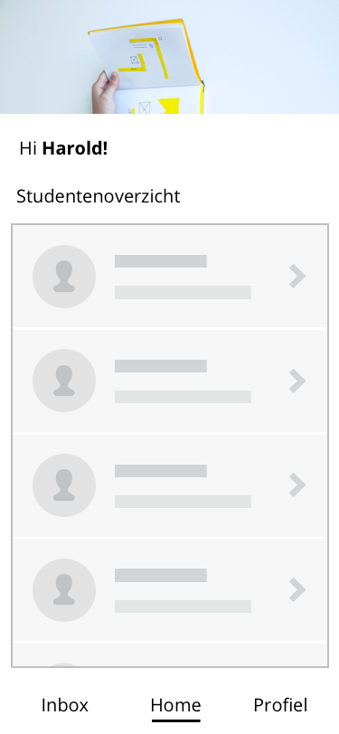
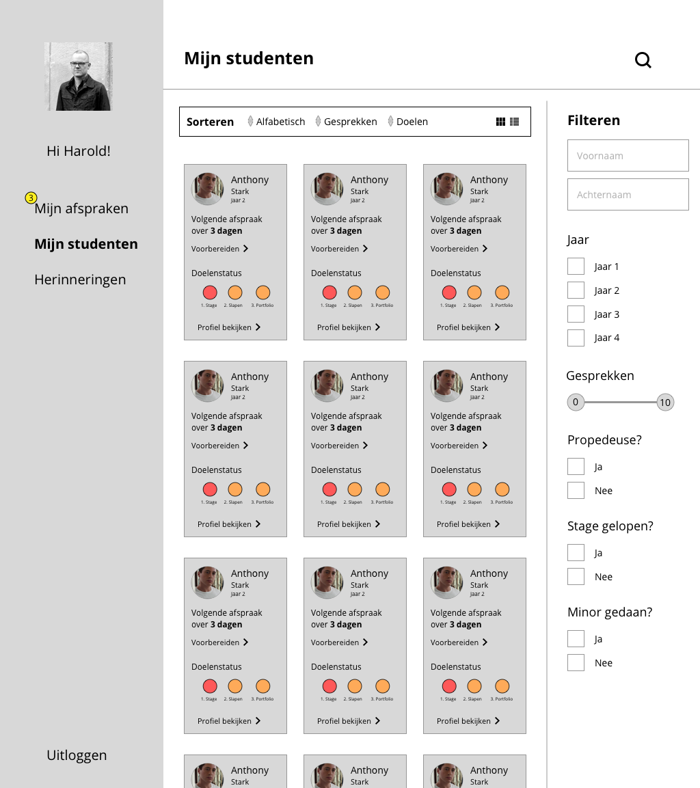

# SLC-O \(SLC'er versie\)

## Versie 1


_Klik op de afbeeldingen om ze uit te vergroten_


### \*\*\*\*

### **Het concept \(SLC’er versie, APP\)**

Voor de SLC’er zijn 3 punten belangrijk:

•               Wie zijn de studenten van de SLC’er?

•               Waar zijn ze mee bezig?

•               Hoe kan ik ze helpen/ondersteunen?

Dit heb ik vervolgens verwerkt in de eerste versie. Omdat de focus op de CMD’er versie lag, heb ik alleen het home scherm Hi-FI geschetst. Het idee is dat de SLC’er de bovenstaande punten kan toepassen op het home scherm en berichten kan ontvangen van zijn studenten.

### 
Eerste scherm \(SLC’er versie\)

Voor de SLC’er versie had ik een idee die ik snel in het proces wou testen met SLC’ers. Het was belangrijk om te kunnen vertellen en minimaal laten zien wat het concept voor de SLC’er was.

Hieronder zien we de home scherm:

De SLC’er kan op een praktische wijze zien en filteren op zijn of haar studenten en wordt door middel van slimme herinneringen gehol- pen door het systeem om zijn of haar studenten niet uit het oog te verliezen.

Het was belangrijk voor de SLC’er om te we-ten wie zijn/haar studenten zijn, wat ze doen en hoe de SLC’ers zij hun daarbij kan helpen.

Verder zien we een inbox waar de SLC’er alle chat berichten van de studenten binnenkrijgt.

## Versie 2


_Klik op de afbeelding om ze uit te vergroten_



Voor de SLC’er koos ik ervoor om de belangrijkste scherm uit te werken tot een hifi. Dit deed ik om SLC'ers een beeld te geven hoe de SLC'er versie eruit zou kunnen zien op desktop.

Verder dan dit zal ik het voorlopig niet meer uitwerken omdat de volledige focus zit op de CMD’er versie.

Hiernaast zien we de mijn studenten pagina. Een pagina waar de SLC’er al zijn studenten ziet en kan filteren om studenten te zoeken of te bekijken.

Verder zien we het kopje afspraken. Hier krijgt de SLC’er de afspraak aanvragen binnen van de CMD’ers.

Bij het kopje herinneringen kan de SLC’er aangeven hoe vaak hij of zij herinnering wilt worden, per student, per onderdeel \(heeft de studenten doelen behaald, volgende afspraak, te weinig studiepunten etc\).

Ik was benieuwd naar de reacties van de CMD’ers en SLC’ers. Lees verder op de volgende pagina hoe ik versie 2 heb getest.

