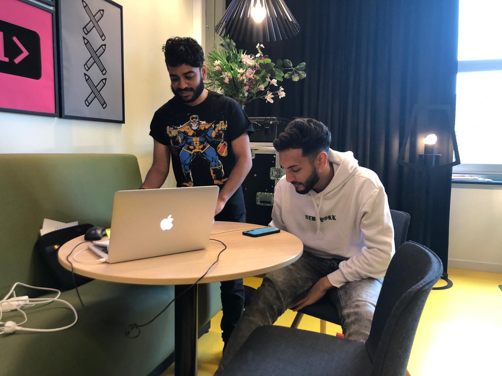

# Taufieq Hussainali

## Onboarding

### Algemene punten over deze flow/pagina

-

### Waar staat SLC-O voor?

-SLC Ondersteuning

### Wat is jouw verwachting van de app o.b.v introscherm?

-Een tool die jouw ondersteunt; Dat betekent helpen, begeleiden en in de juiste richting stuurt

### Hoe denk je over het inloggen met je HvA ID voor de app?

-Makkelijk!

## Home

### Algemene punten over deze flow/pagina

-Ik zie dat Harold mijn SLC'er is en dat ik word begroet.

### Wat is het hoofddoel van deze pagina?

-Het hoofddoel is om afspraken aan te vragen. 

### Gesprek aanvragen

#### Wat wordt er bedoelt met "je volgende afspraak...ingepland" ?

-Dat een afspraak wel of niet is ingepland. Ik denk dat een betere CTA nodig is om duidelijk te maken dat je erop kan klikken.

#### Wat verwacht je wanneer je klikt op gesprek aanvragen?

-Er een overlay komt dat je snel een gesprek of afspraak inplannen.

### Jouw doelen

#### Wat is er mogelijk in de sectie "jouw doelen" ?

-Je opgestelde doelen bijhouden

#### Hoe zou je een nieuw doel toevoegen?

-Klikken op het gele icoon met het plus.

#### Wat verwacht je als je op het gele icoon met plusje klikt?

-Dat ik een doel kan toevoegen in een overlay of nieuwe pagina.

#### Hoe zou het doelen toevoegen proces voor jou idealiter gaan?

-Vind ik moeilijk om te zeggen

#### Wat betekenen de kleuren bij de "jouw doelen" sectie?

-Rood is deadline al klaar en groen betekent dat deadline nog niet klaar is.

### Harold Konickx

#### Wat zie je gebeuren/wat is er mogelijk in deze sectie?

-Waarover het gesprek gaat en waar. Oh nee, het is het rooster van Harold, zodat ik weet wanneer ik kan langsgaan als ik dat wil. Ik zie zijn bereikbaarheid door zijn rooster.

#### Wat verwacht je als je op "neem contact op" zou drukken?

-De contactgegevens van Harold.

#### Welke contact gegevens verwacht je?

-Nummer en mail

## Mijn doelen 

### Algemene punten over deze flow/pagina

-De plusjes zijn lees meer knopjes zodat je meer kan lezen over de onderwerpen. Ze kunnen zorgen voor inspiratie zodat je betere doelen kan maken.

-Manier van vragen komen niet over als doelen

-Het moet duidelijker zijn dat iets een doel of target is met de manier van verwoorden van de app.

-Als een datum is vervallen, hoe kan je er dan het beste mee omgaan.

**Wat houdt de doelen 2e jaar in?**

**-**Inspiratie om doelen toe te voegen door er over te lezen

**Wat houdt de sectie CMD doelen in?**

**-**Potentiële cmd doelen van de komende jaren of afgelopen jaren toevoegen door eerst inspiratie te krijgen.

## Mijn SLC'er

### Algemene punten over deze flow/pagina

-

#### Zou je nog op een andere manier contact willen opnemen met je SLC'er?

-Nee maar misschien wel zijn gegevens kunnen kopieren zodat je deze kan delen met iemand.

## Gesprek aanvragen

### Algemene punten over deze flow/pagina

-Op basis van je onderwerp die meegeeft, vervolg vragen die je helpen om de keuze makkelijker te maken. Dus als je bijv kiest voor studie keuze dat je in een tussen scherm kan kiezen waar tussen je twijfelt. Dit maakt het helderder voor de SLC'er.

-Voorstel &gt; aanvraag

### Onderwerp

#### Wat vind je van de beschikbare onderwerpen?

-Over het algemeen duidelijk

-maar ga je niet eerder voor een herkansing naar de leraar waar je mee te maken hebt?

-Studiekeuze lijkt me niet echt passen of hij moet duidelijker wat er mee wordt bedoelt

-Bij persoonlijke omstandigheden kan je eerder stellen: "Ik wil het hebben over.."

#### Zijn onderwerpen die je zou kunnen samen voegen of toevoegen?

-Nee

#### Heeft de tagline onderaan het onderwerp waarde?

-Meeste wel behalve persoonlijke omstandigheden en overige vragen

#### Weet je hoeveel stappen je nog moet ondernemen voordat je klaar bent?

-

### Context

#### Wat kan je doen op deze pagina?

-Hier kan je tekst uittypen en bijlage mee sturen. Ik weet alleen niet hoeveel ik moet typen of kwijt moet. Ik wil  geen dagboek schrijven maar wel duidelijk zijn.

#### Is het duidelijk wat je kan uploaden?

-Daar kom je achter als je klikt. Het is voor de hand liggender als je bijlage kan doorsturen naar een vak docent.

#### Hoeveel waarde geeft de voorbeeld zin mee?

-Heeft in deze situatie geen waarde

#### Is er iets wat mist op deze pagina?

-

### Wanneer

#### Wat kan je doen op deze pagina?

-Datum kiezen door te swipen en te selecteren

#### Is er iets wat mist op deze pagina?

-Eigenlijk geef je eerder een voorstel dan een aanvraag of inplannen. Dat kan duidelijker.

## Overige vragen/opmerkingen

-Krijg je reactie over je vraag via de app? Alles op 1 plek is wel handig

-Kan je misschien toegang krijgen tot de agenda van de student en/of slc'er?

-Doelen toevoegen dmv suggesties en voorbeelden kan studenten heel erg helpen met het maken van doelen. Misschien een idee om een ontdek pagina te hebben en te zien wat andere studenten doen en hoe het gaat met hun doelen.

-Als je klikt op het plusje dan is meer info wel een goed idee om vervolgens daaronder wel echt een doel toe te voegen die voorgekauwd is

-Herinneringen moet duidelijk want het lijkt op een pagina header.

## Zou je SLC-O liever als een app of een website willen gebruiken en waarom?

-Op mobiel werk ik fijner maar het is dat meer dat ik niet steeds opnieuw url hoef in te tikken.

## Inzichten

* @onboarding; Duidelijk hoe het overkomt bij Taufieq, het kan geen kwaad om nog meer uit leggen wat de gebruiker kan verwachten in de app voor het inloggen
* @Home;  Het hoofddoel is duidelijk maar er valt meer te winnen op gebied van Call to Actions \(CTA\) en meer structuur.
* @Doelenpagina; Het is onduidelijk voor Taufieq dat hij doelen met 1 klik kan toevoegen. Hij zag namelijk in dat je eerst meer info krijgt over een onderwerp. Hier inspiratie van krijgt om vervolgens een doel te formuleren. Dat is totaal geen gek idee. Alleen dient dit wel op de juiste manier verwerkt te worden.
* @mijnslc'er;  Niet veel bijzonder feedback
* @Gesprekaanvraag; Door meer te testen met gesprekken aanvragen zal ik er beter achter komen wat een nog betere manier is van aanvragen van een gesprek. Bovenstaad staan interesante inzichten die ik meteen kan meenemen.

