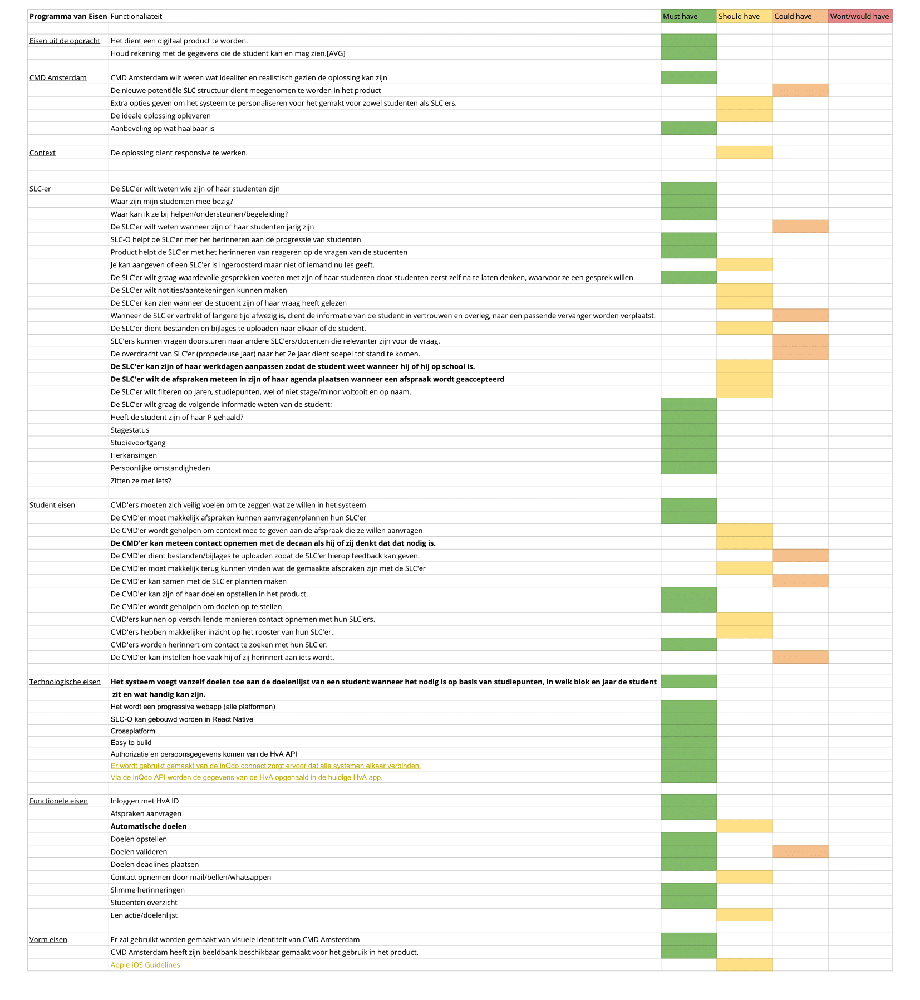

# Programma van Eisen V3

## Moscow

\*\*\*\*[**Klik hier om in google spreadsheet, mijn PvE te bekijken.**](%20https://docs.google.com/spreadsheets/d/17EzJYxNajg1VLB1lmjGN_QMLkNg7Ke7_B_FIwayXoNI/edit#gid=1871061768)\*\*\*\*

De **dik gedrukte** eisen betekenen dat ze ten opzichte van de vorige versie nieuwe eisen zijn.

## Eisen uit de opdracht

* [x] Het dient een digitaal product te worden.
* [ ] Houd rekening met de gegevens die de student kan en mag zien.\[AVG\]

## CMD Amsterdam

* [x] CMD Amsterdam wilt weten wat idealiter en realistisch gezien de oplossing kan zijn
* [ ] De nieuwe potentiële SLC structuur kan meegenomen te worden in het product
* [ ] Een sterke basis aan gegevens die de docent en student minimaal moeten invoeren om het product goed zijn ding te laten doen, namelijk de communicatie drempel laag houden en de brug verstevigen tussen beide partijen.
  * [ ] Extra opties geven om het systeem te personaliseren voor het gemakt voor zowel studenten als SLC'ers.
* [ ] De ideale oplossing opleveren
* [ ] Aanbeveling op wat haalbaar is

## Context eisen

* [x] De oplossing dient responsive te werken.
  * [x] Mobiel
  * [ ] Tablet
  * [x] Desktop

## SLC-ers eisen

* [ ] De SLC'er wilt weten wie zijn of haar studenten zijn
* [ ] Waar zijn mijn studenten mee bezig?
* [ ] Waar kan ik ze bij helpen/ondersteunen/begeleiding?
* [ ] De SLC'er wilt weten wanneer zijn of haar studenten jarig zijn
* [ ] SLC-O helpt de SLC'er met het herinneren aan de progressie van studenten
* [ ] De SLC'er wilt graag in 1 opslag kunnen zien wie zijn of haar studenten zijn en waar ze nu mee bezig zijn.
* [ ] Je kan aangeven of een SLC'er is ingeroosterd maar niet of iemand nu les geeft. 
* [ ] De SLC'er wilt graag waardevolle gesprekken voeren met zijn of haar studenten door studenten eerst zelf na te laten denken, waarvoor ze een gesprek willen.
* [ ] De SLC'er wilt notities/aantekeningen kunnen maken per student
* [ ] Wanneer de SLC'er vertrekt of langere tijd afwezig is, dient de informatie van de student in vertrouwen en overleg, naar een passende vervanger worden verplaatst.
* [ ] De overdracht van SLC'er \(propedeuse jaar\) naar het 2e jaar dient soepel tot stand te komen.
* [ ] De SLC'er wilt filteren op jaren, studiepunten, wel of niet stage/minor voltooit en op naam.
* [ ] De SLC'er kan zijn of haar werkdagen aanpassen zodat de student weet wanneer hij of hij op school is.
* [ ] De SLC'er wilt de afspraken meteen in zijn of haar agenda plaatsen wanneer een afspraak wordt geaccepteerd
* [ ] De SLC'er wilt graag de volgende informatie weten van de student:
  * Heeft de student zijn of haar P gehaald?
  * Stagestatus
  * Studievoortgang
  * Herkansingen
  * Persoonlijke omstandigheden
  * Zitten ze met iets?

## Student eisen \(Functioneel, emotioneel en Sociaal\)

* [ ] CMD'ers moeten zich veilig voelen om te zeggen wat ze willen in het systeem
* [ ] De CMD'er moet makkelijk afspraken kunnen aanvragen/plannen hun SLC'er
* [ ] De CMD'er wordt geholpen om context mee te geven aan de afspraak die ze willen aanvragen
* [ ] De CMD'er kan meteen contact opnemen met de decaan als hij of zij denkt dat dat nodig is.
* [ ] De CMD'er dient bestanden/bijlages te uploaden zodat de SLC'er hierop feedback kan geven.
* [ ] De CMD'er moet makkelijk terug kunnen vinden wat de gemaakte afspraken zijn met de SLC'er
* [ ] De CMD'er kan samen met de SLC'er plannen maken
* [ ] De CMD'er kan zijn of haar doelen opstellen in het product.
* [ ] De CMD'er wordt geholpen om doelen op te stellen
* [ ] CMD'ers kunnen op verschillende manieren contact opnemen met hun SLC'ers.
* [ ] CMD'ers hebben makkelijker inzicht op het rooster van hun SLC'er.
* [ ] CMD'ers worden herinnert om contact te zoeken met hun SLC'er.
* [ ] De CMD'er kan instellen hoe vaak hij of zij herinnert aan iets wordt.

## **Technologische eisen**

* [ ] Het systeem voegt vanzelf doelen toe aan de doelenlijst van een student wanneer het nodig is op basis van studiepunten, in welk blok en jaar de student zit en wat handig kan zijn. De student kan dit nog altijd verwijderen.
* [ ] Het wordt een progressive webapp \(alle platformen\)
* [ ] SLC-O kan gebouwd worden in React Native
  * Crossplatform
  * Easy to build
* [ ] Authorizatie en persoonsgegevens komen van de HvA API
* [ ] Er wordt gebruikt gemaakt van de [inQdo](https://www.inqdo.com/) connect zorgt ervoor dat alle systemen elkaar verbinden.
  * Via de inQdo API worden de gegevens van de HvA opgehaald in de huidige HvA app.

## Functionele eisen

* [ ] Inloggen met HvA ID
* [ ] Afspraken aanvragen
* [ ] **A**utomatische doelen
* [ ] Doelen opstellen
* [ ] Doelen valideren
* [ ] Doelen deadlines plaatsen
* [ ] Contact opnemen door mail/bellen/whatsappen
* [ ] Slimme herinneringen
* [ ] Studenten overzicht
* [ ] Een actielijst 

## Vorm eisen

* [x] Er zal gebruikt worden gemaakt van visuele identiteit van CMD Amsterdam
* [x] CMD Amsterdam heeft zijn beeldbank beschikbaar gemaakt voor het gebruik in het product.
* [ ] [Apple iOS Guidelines](https://developer.apple.com/design/resources/)

## Andere opties

## Moscow



