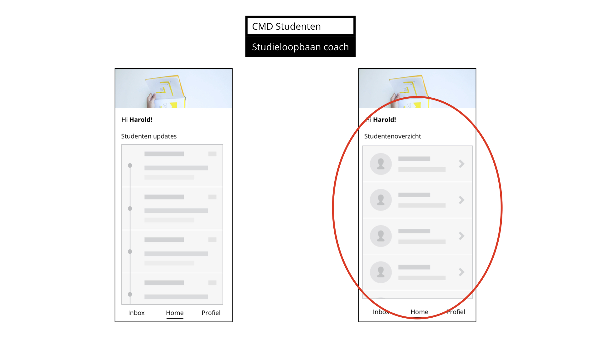

# Valina Convent

## Algemene punten

* Het contact met studenten zijn vaak niet waardevol genoeg.
  * Vaak wordt Valina gezien als "de navigatie van moodle" om vragen te beantwoorden die studenten makkelijk zouden kunnen vinden.
    * Dit zorgt ervoor dat de student lui wordt.
      * Het is dus extra belangrijk dat het product inderdaad laagdrempelig is maar de studenten niet lui maakt. 
* Huidige contact met de student verschilt enorm
  * Wanneer het tegen valt kost het tijd en energie. 
* "Het gaat heel erg om het schetsen van een duidelijke verwachtingsmanagement.
  * Denk hierbij aan afspraken en verwachten van te voren vastellen met de student.
    * In de vorm van contract, normen en waardes etc." 
* Studenten zouden zich verantwoordelijker moeten voelen en beter moeten voorbereiden voordat ze gebruik maken van de SLC'er
  * Zo zorg je er beter voor dat de contact momenten waardevoller worden.
  * Misschien studenten van te voren taken meegeven voordat ze een bericht kunnen sturen.
  * Harmonica flow, zodat de student aangeven hoe ver hij nu is voor een bepaald doel. 
* Onderzoek naar de motivatie van studenten om proactiever om te gaan met SLC

## Wat Valina in het product zou willen zien

* Studenten sorteren op basis van 
  * Aantal jaar CMD'er en dus niet schooljaar/klasjaar
  * Waar de student meebezig is
  * Sorteren op voornaam of achternaam
  * Laats gesproken/gezien 
* Misschien interessant om de gesprekken direct bij de studenten te zetten en de studenten centraal maken in het product. 
* SLC'ers kunnen wel meldingen ontvangen maar studenten moeten al eerst hebben "nagedacht" over hun eigen vraag
  * Denk hierbij aan voorbereiding of eigen onderzoek voordat je naar de SLC'er gaat 
* Praktische overzicht
  * Geen behoefte aan een tijdlijn of iets waar Valina tijd in moet investeren waar ze niet genoeg waarde uit haalt

* "Ik verwacht dat ik mijn profiel maar 1x hoeft in te vullen. Daarom lijkt het me onnodig om het op 1 niveau te hebben met _Home_  en _Inbox/chatten"_ 
* "Wanneer er afspraken worden gemaakt met een student, dan moet ik het alsnog handmatig in mijn agenda plaatsen. Misschien kan je hier iets mee?" 
* "Ik zou liever berichten willen sturen naar studenten via zo een applicatie of systeem dan via de mail als de koppelingen goed werken." 
* "Op een mobiel scherm werken vind ik niet prettig. Dus een desktop versie is een must."

## Opmerkingen over het nieuwe SLC Structuur

* Goede manier van coaching betreft de een bepaalde context/achtergrond van de student
* SLA, B en C zijn nog deels verwarrend
* Misschien kan een rubriek en voorbeelden beter helpen bij het idee geven waar welke A,B of C voor staat.

