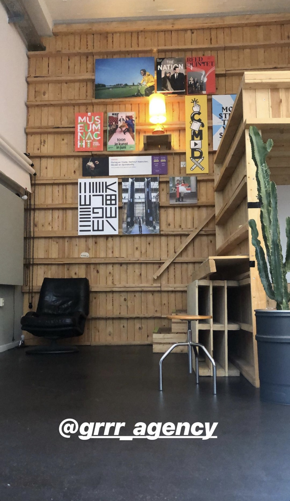

# Jeroen Disch \| GRRR

## 8 Mei 2019 

Jeroen is lead designer bij GRRR. Bekijk hier wat ze doen: [www.grrr.nl/](www.grrr.nl)

Op 8 mei heb ik voor Jeroen gepresenteerd. Hieruit zijn interessant inzichten en punten gekomen. Lees deze hieronder.

## Feedback presentatie 

* Interessant onderzoek
  * Maar je kan het nog meer aanscherpen om de focus duidelijk te houden jouw idee het probleem oplost 
* Door een prototype toe te voegen bij je presentatie zorg je ervoor dat je een extra dynamiek toevoegt aan je presentatie. 
* Ik mis nog een soort conclusie in je presentatie
  * Iets wat laat zien en duidelijk maakt hoe je product de probleem punten aanpakt
  * Zodat de volledige cirkel rondt komt 
* Kleine spelling foutjes 
* Splits je keynote interface in tweeën: SLC'ers en CMD studenten.
  * Zo kan je duidelijker je verhaal vertellen en snapt de gene waar je voor presenteert beter wat de oplossing is voor welke stakeholder.

## Feedback product/concept

* Interessant onderzoek
  * Maar je kan het nog meer aanscherpen om de focus duidelijk te houden jouw idee het probleem oplost 
* Waarom is er geen vast moment voor de SLC'er om te praten met zijn of haar studenten?
  * Armand: SLC'ers hebben 15-25 studenten wat het heel lastig maakt om vaste momenten in te plannen in verband met rooster en vooral tijd. 
* Leg je focus duidelijker op het probleem
  * Studenten
    * Er is een drempel om contact op te nemen
    * Studenten willen wel werken aan hun persoonlijke ontwikkeling maar niet alleen
    * Studenten kunnen niet op tijd aan de bel trekken wanneer ze dat willen of zouden moeten
      * kloppen deze probleem ?
  * Als er een drempel is, is dan een whatsappgroep niet meteen een oplossing? 
  * SLC'ers probleem
    * Gesprekken moeten waardevoller zijn, studenten dienen met "betere kwesties langs te komen"
    * Studentenoverzicht brengt overzicht
    * Reminders zijn handig
  * Voor de SLC'er is veel duidelijker wat het probleem is en hoe je dat kan oplossen.
* Het blijft lastig om te testen aangezien het om gebruik voor langere tijd gaat maar
  * Blijf goed testen op gebruik 
  * En let op of je vertrouwen kan meten om een inschatting te maken 
* Je product haalt sowieso heel wat ruis was en dat is positief 
* Offerte aanvraag wordt nog naar gekeken a.d.h.v Design Rationale. 

## Feedback UX/UI/Visual

* Het ontwerp is heel functioneel gemaakt
  * Pak vooral de iOs patterns uit hun design system
    * Deze zijn heel geschikt 
* Over het algemeen je consistenter te werk gaan door het allemaal even strak te trekken 
* Maak 90% met de default iOs patterns &
  * 10% een eigen unieke branding -&gt; CMD Stijl 
* Herinnering knop, denk goed erover na wat het doel is en waar hij dan hoort 
* Grijze kleur geeft een droog/houterig gevoel
  * Randen zou ik afraden om het geel te maken
  * Button ontwerp kan consistenter  
* Let op hoe je de foto's gebruikt
  * Daarin zitten ook de CMD iconen en zijn in de foto's niet klikbaar maar wel in de app
    * Dit kan voor verwarring zorgen 
* Homebar, maak de iconen niet negatief/inverted \(omgekeerd\)
  * Dit veranderd het logo en dus ook de identiteit
    * Door ze bijv wit te laten maar een randje eromheen te doen kan je het zelfde doel bereiken
  * ING gebruikt een witte leeuw op een oranje achtergrond. Wanneer de kleuren worden omgedraaid blijft het gezicht van de leeuw hetzelfde. Het behoudt dus zijn identiteit.

