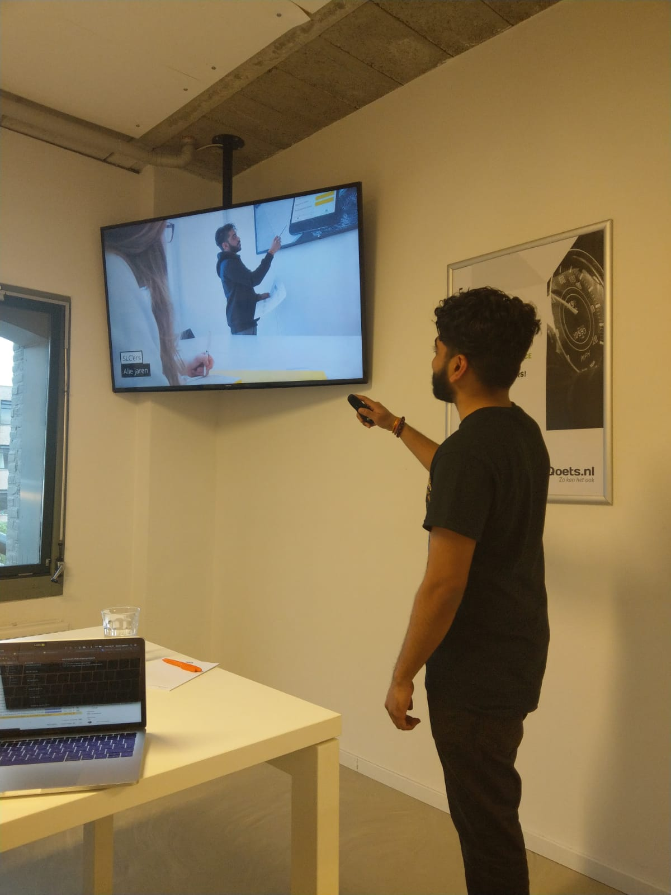

# Label A

8 Mei 2019 

Maik - Design lead 

Gavin - Front-end developer 

Jeroen - Back-end lead

## Feedback Maik

### Algemeen/presentatie

* Presenteer concept in invision
  * Dan komt het dynamischer over
* Goed en lekker gepresenteerd
  * Mooie presentatie ook
  * Je bent voorbereid!
* De user journey maken en toevoegen

### Concept

* F.A.Q  maken om de onderwerpen specifieker te maken @ afspraak pagina
* Maak een user journey
  * Dan kan je het verhaal beter vertellen van bijv de student en dat geeft een duidelijker beeld van je totale afstuderen
* Studie
* "Wat zou studenten motiveren om het te gebruiken?"
  * Optimaal persoonlijke ontwikkeling
  * Motiverende doelen
  * Gefocust gesprek
  * Gesprekstof
    * Wat zijn de sellingpoints?
* "Is het duidelijk dat er bij CMD een fundamenteel probleem is"
  * SLC naam/branding kan beter
* Waarom is het specifiek een app?
  * Presenteer het meer als een web app?

### Techniek

* Vertel het doel van je technische tekening en niet meer
  * Zorgt alleen maar voor meer vragen
* Goed dat je het hebt uitgezocht

### Visual/UX/UI

* Ziet er prima uit!

## Feedback Jeroen

### Algemeen/presentatie

* "Je vertelt het heel makkelijk dus dat is heel nice"
* "Het is indrukkend hoe je denkt over de opdracht en toch redelijk kleinschalig houdt"
* Alles wat je zegt zou je hard moeten kunnen maken voor het geval dat.
* De quotes zijn heel sterk
* Misschien kan je in de presentatie meenemen of het soms ook goed gaat. 

### Concept

* Misschien is je hoofd feature wel de focus op de doelen.
* De term SLC bekt niet lekker
  * Geen fijn gevoel erbij
    * De term coach zou al beter werken, misschien kan je dat meenemen?
* Misschien kan je met een faq "de onzin vragen" oplossen.

### Techniek

* Het is super haalbaar om te maken
* Ik had de vraag betreft de HvA api maar dat had je snel gecoverd omdat je het kon uitleggen.
* Misschien kan je  toevoegen dat je beschikbaarheid ziet van andere slc'ers.
  * Beschikbare inloop
    * Denk aan google calander
    * Vaste momenten
* Controleer goed wat privacy gevoelig is

### Visual/UX/UI

* Ziet er mooi en netjes uit

## **Feedback Gavin**

### Algemeen/presentatie

* Prima gepresenteerd
* "Kom vooral weer langs om te sparren"
* "Bij Label A gebruiken we Lattice"
  * [https://lattice.com/](https://lattice.com/)
    * Binary -&gt; Datum/deadline aangeven
    * Pound\_ Stap 0 tot 100
    * Percentage meegeven
      * Zo kan je het meetbaar maken dmv Key results

### Concept

* Het is goed dat je focus houdt op persoonlijke ontwikkeling
  * Maar maak duidelijk dat als het over doelen gaat, dat je het daarover hebt als focus.
    * Houd het klein
* Het kan een idee zijn om SLC'er kant los te laten
  * Zodat je beter kan focussen op de studenten.
* Duidelijk probleem
* Misschien kan je het koppelen met SRP

### Techniek

* Het feit dat je hebt gesproken met developer van de HvA app
  * Betekent veel
* Kijk goed of je een app of web app wilt en waarom

### Visual/UX/UI

* Geen opmerkingen

