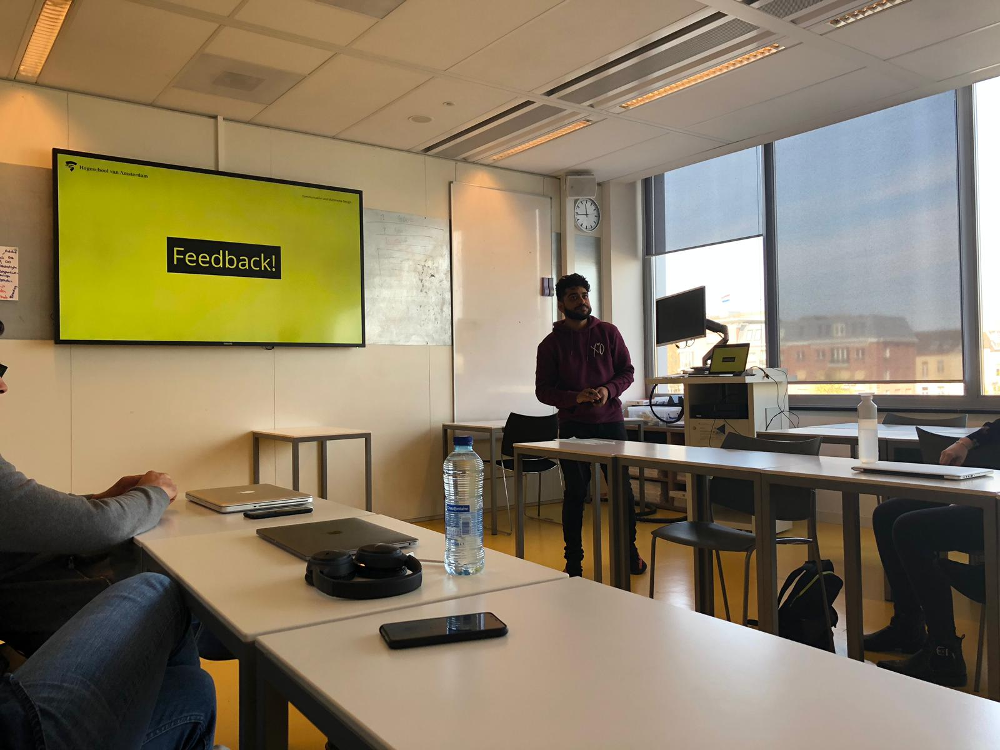

# Feedback Frenzy

Op dinsdag 9 april deed ik mee aan een feedback frenzy. Dit betekent dat je mogelijkheid krijgt om aan een groep van medestudenten en afstudeerbegeleiders feedback te krijgen op dat waar je feedback op wilt krijgen. Het is de bedoeling dat je jouw concept/concepten/ideeën presenteert en feedback verzamelt over de punten waar je zelf twijfels over hebt.

Het was mijn persoonlijke doel om vooral validatie te krijgen en beter te weten welke richting mijn product op zou kunnen gaan. Terugkijkend vond ik erg nuttig. Waarom? Lees snel verder.

## Waarop wou ik feedback krijgen?

* Aangezien mijn doelgroepen ook de mensen zijn waar ik voor ging presenteren, wou ik graag horen wat de eerste gedachte gangen waren. 
  * Zo kreeg ik te horen dat de begeleiders enthousiast waren op het feit dat ze de mogelijkheid zouden kunnen krijgen om beter te weten waar hun SLC studenten mee bezig zijn
  * Studenten gaven duidelijke punten op wat ze tof vonden en waar er twijfel over hadden.
* Ik wou graag feedback op de samenstelling van de app \(studenten versie\)
  * Zo kreeg ik te horen dat de samengestelde doelen zeer handig zijn voor zowel de student als slc'er.
* Over het algemeen was iedereen enthousiast op [het product](https://app.gitbook.com/@armandbissesar/s/slc-online/product-ontwikkeling/het-product).

## Feedback

* Meldingen kunnen koppelen aan je mail
  * Mail zelf in kunnen stellen
* Do Not Disurb modus voor de SLC'ers
* Online/offline tijden voor SLC'ers
* Bereikbaar van SLC'er duidelijk naar voren brengen
* Meldingen zijn heel goed en maken het verschil
* Onderzoeken of dit systeem verwerkt zou kunnen worden in een API om vervolgens in Bright Space te stoppen
* Onderzoeken naar de app "Franz". Een samenstelling van applicaties.
* Toevoeging van "notities/logboek/bespreekbord" om voor te bereiden voor je gesprek.
* Profiel is niet zo belangrijk als de rest

