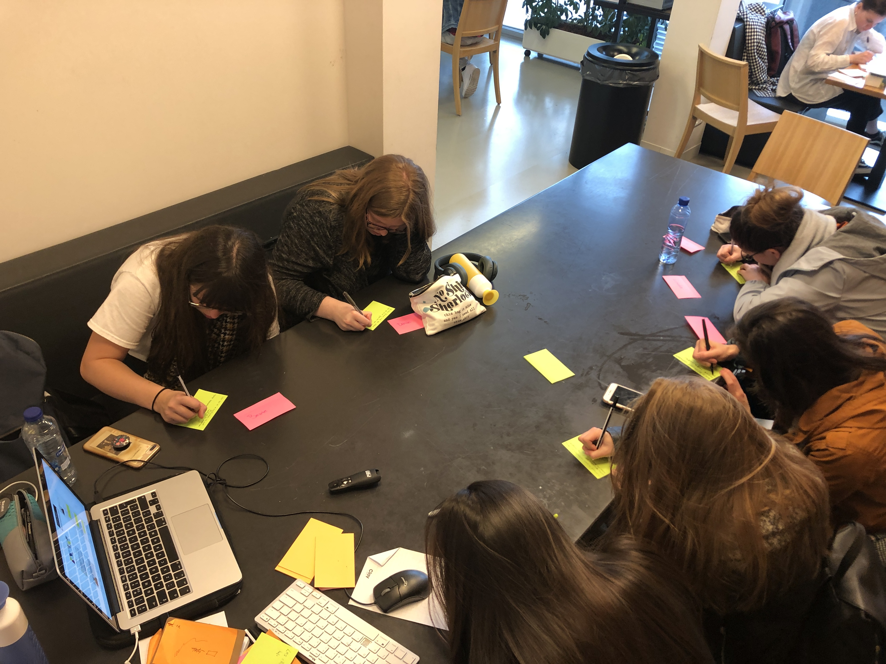
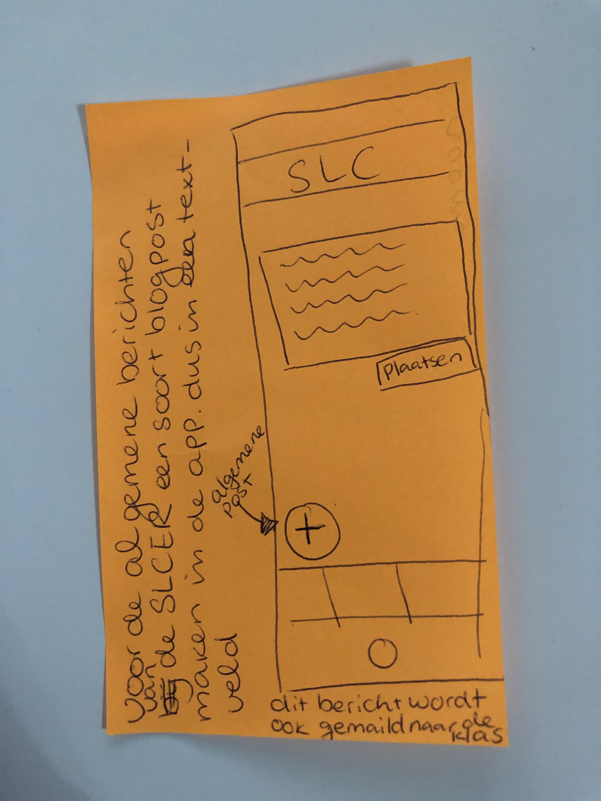
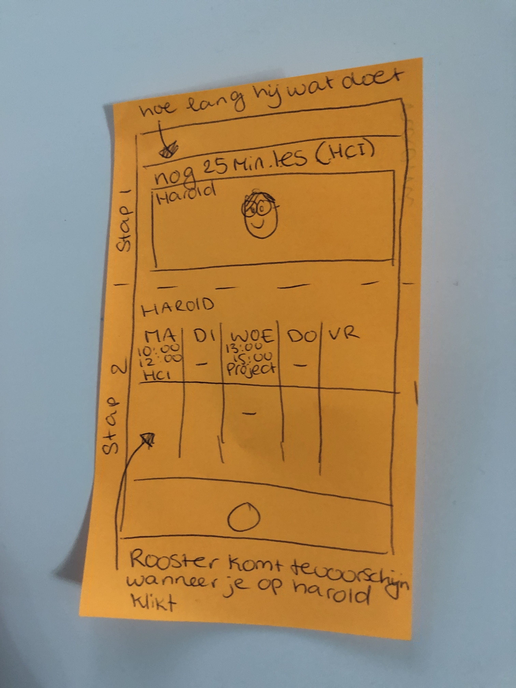
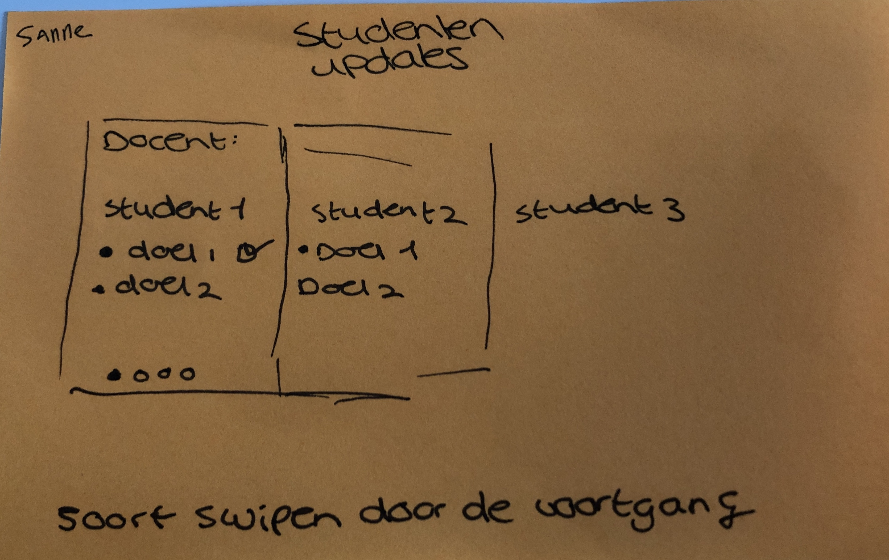
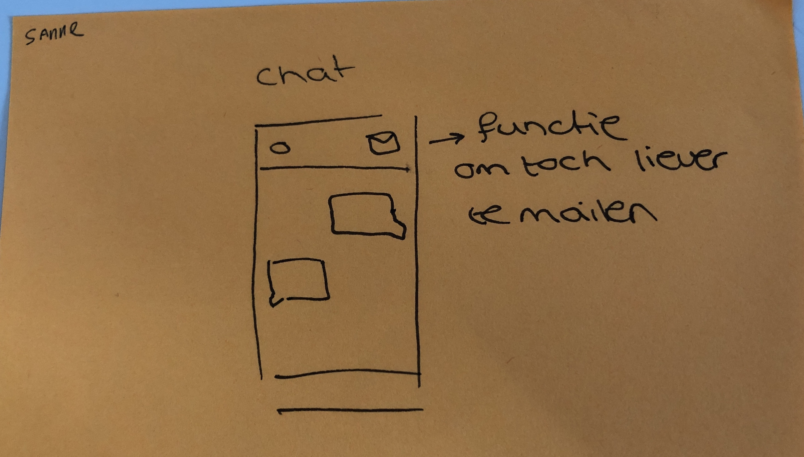
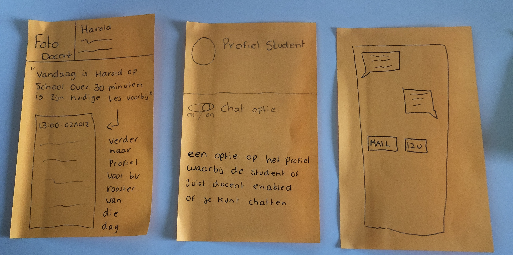
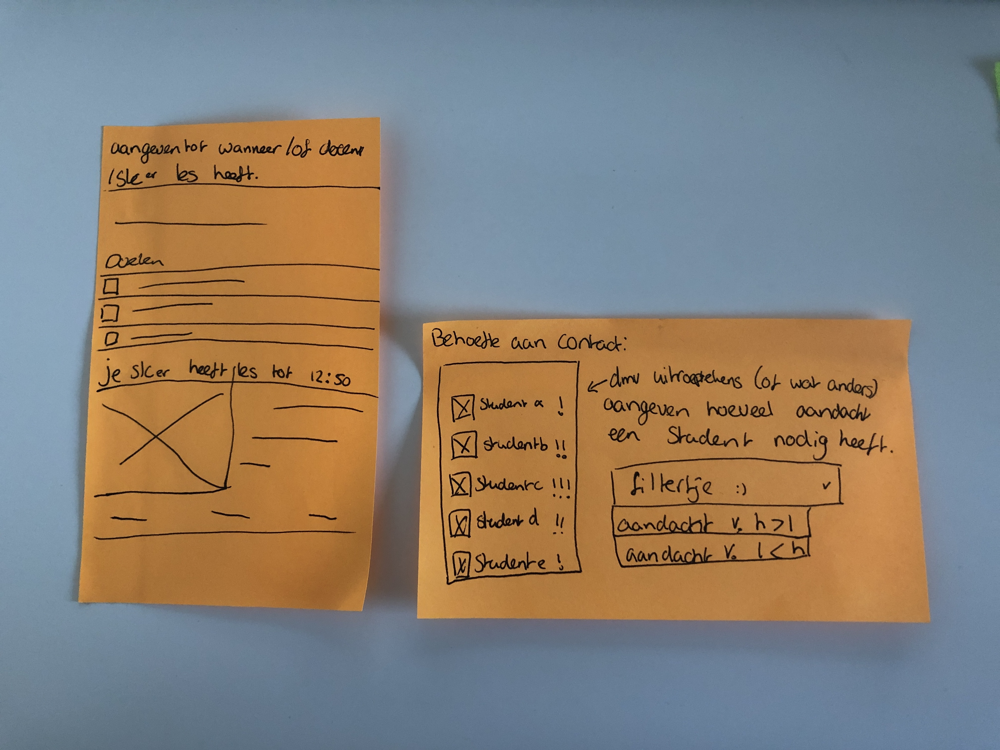
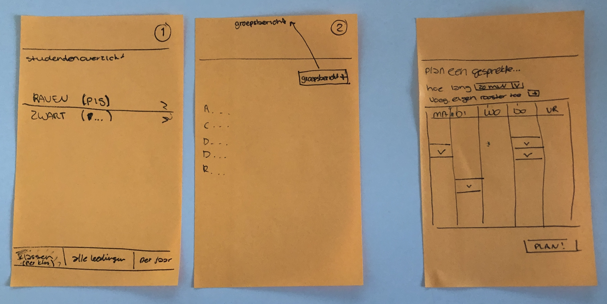

# Klas Raven

Woensdag 17 april

## Naomi Nazar

### Feedback

* Het is handig om in de app ook te zien of de docent op het moment van beschikbaarheid ook les geeft of niet.
* Legt zo een app ook niet extra druk op de SLC'er
* Wat voor waarde heeft de app voor iemand die het niet zo goed kan vinden met zijn of haar SLC'er?

### Schets/idee/uitwerking van het product

* De SLC'er de mogelijkheid geven om algemene post/statussen te plaatsten voor al haar/zijn SLC studenten.

* Het rooster van de docent is te zien in de app.
  * Wanneer je klikt voor meer informatie dan ziet je ook echt het rooster van de docent.
    * Zo kan je als student inschatten of je langs kan gaan of niet.

## Sanne

### Feedback

* Het concept is goed bedacht & duidelijk
* Voor de studenten kan je nog aangeven waar de docent precies is
  * Waar hij/zij bijv les geeft
* Voor de docent zou je ook kunnen kijken wanneer ze pauze hebben en studenten verwelkomen
  * Dus eigenlijk een soort inloop spreekuur
* Studenten kunnen misschien aangeven hoe betrokken ze de slc'er willen hebben.
* Misschien is een to-do list ook handig voor de slc'er.

### Schets/idee/uitwerking van het product

* De SLC'er kan makkelijk zien wie zijn of haar studenten zijn en de doelen van de studenten
  * Hier kan de SLC'er ze ook afronden door ze af te vinken

* Tijdens het chatten is er de mogelijkheid om te kunnen mailen met de SLC'er.

## Linda

### Feedback

* Goed bedacht maar misschien te persoonlijk
* Laagdrempeligheid is zeker aanwezig
  * Zodat je als student ook met je kleinere problemen makkelijk contact kunt leggen met je SLC'er
* Je kunt niet je eigen SLC'er kiezen
  * Wat als het niet klikt?

### Schets/idee/uitwerking van het product

* Ook kunnen mailen ivm appen/chatten

## Sabine

### Feedback

* Laagdrempelig is goed maar het verschilt per student wanneer iets laagdrempelig is.
* Misschien een optie om de chat functie aan of uit te zetten
* Meldingen misschien koppelen met je school mail zo dat jij en de SLC'er op meerdere plekken bereikbaar zijn.
* De locatie van de docent specifieker maken om de drempel lager te maken maar vooral de bereikbaarheid.
* Houd rekening met het feit dat niet elke leerling dezelfde info met een slc'er wilt delen. Dus dat dit misschien zelf gekozen kan worden in de app tot hoe ver een student wil gaan met privé info delen.
* Wat gebeurd er als je SLC'er niet met je klikt
* Slot systeem moodle interpreteren voor afspraken

### Schets/idee/uitwerking van het product

1. Aangeven wanneer de les van Harold klaar is en welk lokaal.
2. De chatfunctie aan of uit zetten
3. Tijdens het chatten de optie om te mailen

## Denise

### Feedback

* De ene student vind veel contact met de slc'er fijner dan een andere student. Zou je hier onderscheid tussen kunnen maken
* Reminders voor elke student is misschien te veel voor de SLC'er
* Goed dat je contact zoeken tussen SLC'er en docent laagdrempeliger wilt maken.

### Schets/idee/uitwerking van het product

1. Aangeven wanneer de SLC'er lees heeft
2. Als student je behoefte aan contact aangeven dvm !!!!
   1. Dit is ook weer filterbaar voor de SLC'er

## Beate

### Feedback

* Voor SLC'er -&gt; Notificaties te veel? als je bijv meer dan 20 studenten hebt = meer druk?
* De doelen van studenten laten invullen of samen invullen met de SLC'er
* De SLC'er is dan wel op school maar heeft hij dan wel echt tijd voor je?
* Ik mis een behoefte om afspraken te maken
* Automatisch antwoorden kan het doen laten overkomen als onpersoonlijk

### Schets/idee/uitwerking van het product

1. Studentenoverzicht o.b.v klas, alle leerlingen, jaar
   1. De mogelijkheid om groepsberichten te sturen naar een groep studenten
2. Gesprekje plannen obv aantal minuten en de mogelijkheid om je eigen rooster te uploaden

## Algemene feedback punten

* Veel notificaties kan misschien zorgen voor meer druk
* Afspraken plannen met SLC'er mist
* Rooster van een leraar zien kan je goed helpen om in te schatten of je als student naar school wilt komen om hem te spreken
* Verzendlijst voor SLC'ers
* Hebben SLC'ers beroepsgeheim?
* Als er iets invloed heeft op schoolvertraging worden er pas stappen ondernomen
* Miranda voelt aan als een gelijke, klasgenoot en iemand waar je fijn mee kan praten
* Wanneer een SLC'er of docent langzaam reageert op mail dan zullen studenten sneller de docent whatsappen
  * Hier kunnen ze informeler contact leggen met de SLC'er en dat wordt fijn geworden.

