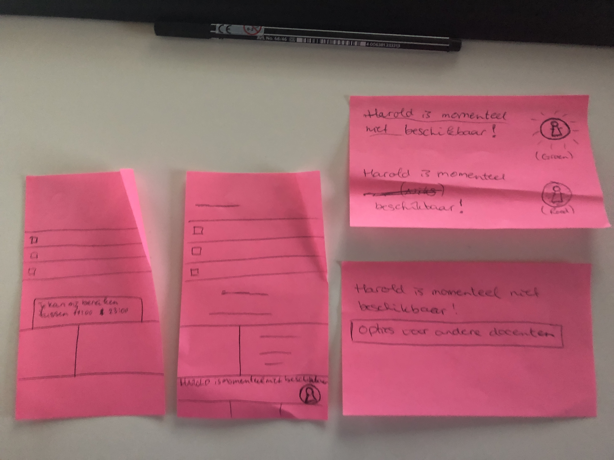

# Klas Paars + Hein

Maandag 15 april

## Bodil

### Wat is SLC voor jou?

* Een klasmoment om feedback te kunnen geven over de vakken, docenten, wat er nu speelt etc
* Vragen stellen aan elkaar of aan SLC'er
* Gezellig relax momentje

### Wat is belangrijk bij de transitie van het eerste naar het 2e jaar voor zowel studenten als SLC'ers?

* Goede klik en open stellen naar elkaar
* Energie willen steken in het willen helpen van studenten en het oplossen van problemen
* Op de hoogte willen blijven van de laatste omstandigheden
* Oprechte interesse in leerlingen

### Algemene feedback

* De app niet te groot maken
* Lijkt mij niet fijn om als docent 100 berichtjes te krijgen van verschillende klassen
* "Momenteel niet bereikbaar functie"
* Bel Harold functie niet altijd klikbaar maken
* Wat voor relatie willen de SLC'ers met studenten en andersom? Wordt het niet te informeel?

### Schets/idee/uitwerking van het product

1. Harold geeft aan wanneer hij bereikbaar is 
2. Harold geeft aan dat hij niet beschikbaar is
3. Kleurgebruik gebruiken om aan te geven of iemand online is
4. De optie om andere docenten te benaderen

## Shelly

### Wat is SLC voor jou?

* Hulp vragen \(school of persoonlijk\)
* Uitleg over verloop studie
* Binding met klasgenoten

### Wat is belangrijk bij de transitie van het eerste naar het 2e jaar voor zowel studenten als SLC'ers?

* Hulp vragen \(school of persoonlijk\)
* Vertrouwenspersoon tot bepaalde hoogte m.b.t eventuele problemen studievoortgang
* Goede klik is belangrijk en oprechte interesse

### Algemene feedback

* Combineren met de HvA App?
* Beide partijen een doel van de student laten afvinken, dan pas is hij klaar
* Ziet er visueel goed uit!
* Out of Office bij meerdere weken weg/afwezig

### Schets/idee/uitwerking van het product

1. Bereikbaarheid van de SLC'er aangeven en alternatieve SLC'ers

## Nensi

### Wat is SLC voor jou?

* -

### Wat is belangrijk bij de transitie van het eerste naar het 2e jaar voor zowel studenten als SLC'ers?

* -

### Algemene feedback

* Combineren met de HvA App?
* Beide partijen een doel van de student laten afvinken, dan pas is hij klaar
* Ziet er visueel goed uit!
* Out of Office bij meerdere weken weg/afwezig

### Schets/idee/uitwerking van het product

* Sorteren op studiejaar 
* Specifieke berichten naar studenten sturen
* Wanneer het niet mogelijk is om te bellen, dit grijs maken

## Hein

### Wat is SLC voor jou?

* -

### Wat is belangrijk bij de transitie van het eerste naar het 2e jaar voor zowel studenten als SLC'ers?

* Altijd binnen 24 uur contact bij "problemen"
* Afspraken 1 op1 
* Veiligheid/Vertrouwen/Positief coachen
* Hulp bij keuzes
* Begrip voor de dip

### Algemene feedback

* Een koppeling met agenda
* Per jaar & vakken filteren: Een lijst studenten per jaar enz
* Groepsafspraken/bijeenkomsten \(bijv klassen na het eerste jaar\)
* Goed idee!
* Handig
* Een vorm van groepschat 

### Schets/idee/uitwerking van het product

* -

## Algemene punten

* Een manier om afspraken aan te vragen
* HvA app combinatie is interessant
* Laatst gezien is niet perse nodig
* Persoonlijk bericht/noot bij de SLC'er
* Oprechte interesse is belangrijk
* Een Decaan heeft geheims houdingplicht
* Persoonlijke notities kan linke soep zijn ivm AVG
* De houding van SLC'er "kom maar naar mij als je problemen hebt zorgt er juist voor dat studenten uit het oog worden verloren"
* Bel tijden kunnen dmv de kleuren groen, oranje en rood de verwachting geven of een docent bereikbaar is om te bellen.

