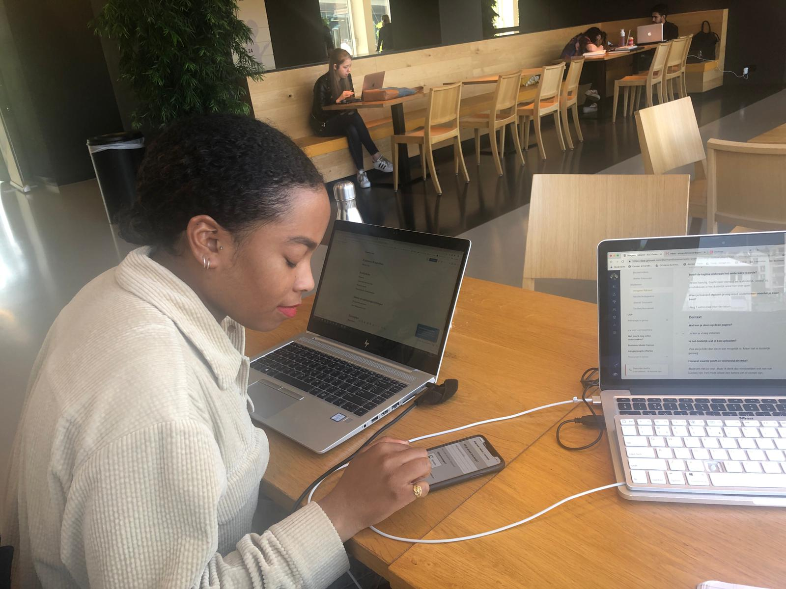

# Imogene Rijkland

## Usability test

## Onboarding

### Waar staat SLC-O voor?

-SLC Ondersteuning

### Wat is jouw verwachting van de app o.b.v introscherm?

-Als student dan kan je waarschijnlijk je cijfers zien, de punten die je nog mist, net zoals sis, waar je mee bezig bent en wat je nog moet doen. Hoe je SRP punten kan halen? Gesprekken kan inplannen met je docent.

### Hoe denk je over het inloggen met je HvA ID voor de app?

-Simpel en heel natuurlijke flow. Je bent het gewend.

## Home

### Wat is het hoofddoel van deze pagina?

-Je kan een afspraak kan maken met je slc'er en je doelen bijhouden. Je eigen overzicht. Agenda achtig. In de zin van online mogelijkheden. Als deze app er niet was dan zou je dit wss in je agenda zetten. Ik wel.

### Afspraak aanvragen

#### Wat wordt er bedoelt met "je volgende afspraak...ingepland" ?

-Een verplichte afspraak met je Harold. Ik denk dat het verplicht is omdat de manier van verwoorden. "Als je een afspraak wilt maken dan kan het er."

#### Wat verwacht je wanneer je klikt op gesprek aanvragen?

-Dat je een tijdslot kan uitkiezen.

### Jouw doelen

#### Wat is er mogelijk in de sectie "jouw doelen" ?

-Doelen toevoegen, afvinken, deadline instellen

#### Hoe zou je een nieuw doel toevoegen?

-

#### Wat verwacht je als je op het gele icoon met plusje klikt?

-Titel doel, deliversbles, bijlage, deadline en aantal uren of minuten aan wilt besteden.

#### Hoe zou het doelen toevoegen proces voor jou idealiter gaan?

-hierboven

#### Wat betekenen de kleuren bij de "jouw doelen" sectie?

-Rood ben je over je deadline en groen is nog haalbaar

### Harold Konickx

#### Wat zie je gebeuren/wat is er mogelijk in deze sectie?

-Je kan zien waar je SLC'er is en of hij op school is.

#### Wat verwacht je als je op "neem contact op" zou drukken?

-Ik verwacht gelijk een popup waar je kan mailen of bericht sturen.

#### Welke contact gegevens verwacht je?

* Mail, whatsapp

## Gesprek aanvragen

### Onderwerp

#### Wat vind je van de beschikbare onderwerpen?

-Er is wel alles denk ik.

Bolletjes laten blijken alsof er meer onderwerpen zijn

#### Zijn onderwerpen die je zou kunnen samen voegen of toevoegen?

-Herkansingen veranderen in studievooruitgang. Misschien andere benaming.

#### Heeft de tagline onderaan het onderwerp waarde?

-Is wel handig. Geeft meer context en is duidelijk. Vooral bij studiekeuze is het duidelijk waar het over gaat.

#### Weet je hoeveel stappen je nog moet ondernemen voordat je klaar bent?

-Nog 1 extra stap voor de datum.

### Context

#### Wat kan je doen op deze pagina?

-Je kan je vraag indienen. Bijlage lijkt me onnodig. Bijlage toevoegen ligt aan het onderwerp.

#### Is het duidelijk wat je kan uploaden?

-Pas als je klikt dan zie je wat mogelijk is. Maar dat is duidelijk genoeg.

#### Hoeveel waarde geeft de voorbeeld zin mee?

-Ik zou het gewoon leeg laten. Want je weet niet hoe het zit. Misschien ik wil graag delen dat..

#### Is er iets wat mist op deze pagina?

-Nee

### Wanneer

#### Wat kan je doen op deze pagina?

-Datum aanvragen

#### Is er iets wat mist op deze pagina?

-Locatie mist, ruimte.

## Doelen

**Wat is er mogelijk op deze pagina?**

De onderwerpen zijn duidelijk, doel suggereren is raar in deze context. Als het suggereren zou moeten zijn dan zou delen beter zijn.

2e jaar is meer van het 2e jaar en CMD doelen is meer van CMD zelf. Dat je kan kijken wat je volgend jaar gaat doen. Het is beetje dubbelop.

### Doelen opstellen

-**Heb je inspiratie nodig om doelen te formuleren?**

Niet als ik zelf een duidelijk doel heb zoals een ux stage zoeken, wel als ik ze smart geformuleerd wil en gekoppeld aan cmd competenties.

## Algemene indruk

* Concept is goed en ik zie dat het uit de behoeftes komt van studenten.
* Het is handig en bevordert het wel de relatie en bereikbaar.
* Meer triggers
* Ik mis een soort een suggestie van een leerpad die zou kunnen bewandelen voor zo min mogelijk vertraging.

## Overige vragen/opmerkingen

-Je zou meerdere datums moeten kunnen aangeven aangezien de SLC’er dan kiezen wanneer het hem of haar uit komt.Zou je SLC-O liever als een app of een website willen gebruiken en waarom?

-Een app. Daar maak ik daar liever gebruik van. Laagdrempeliger en persoonlijker te bereiken. Voelt net als wunderlist. Het is handiger en voor mijn gevoel dichter bij de hand. Maar desktop zou ook handig.

