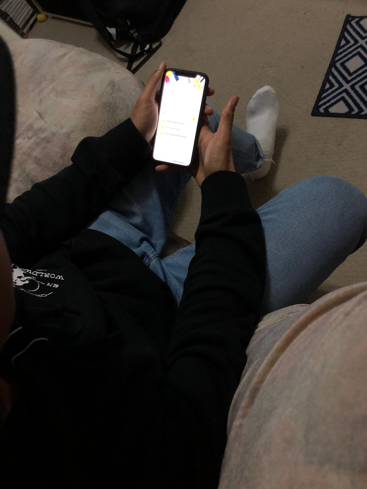

# Neville Notopawiro

Vrijdag 3 mei 2019

## Usability test

## Onboarding

### Waar staat SLC-O voor?

-SLC Ondersteuning

### Wat is jouw verwachting van de app o.b.v introscherm?

-Een studentencommunicatie tool om met SLC'ers te praten, bijhouden van leerdoelen omdat er ontwikkeling staat, cijfers kan terug zien en schoolaanwezigheid van mezelf kan zien. Een soort magister.

### Hoe denk je over het inloggen met je HvA ID voor de app?

-Prima. Neem aan dat je eerste keer moet inloggen en het is bekend voor alle CMD'ers.

## Home

### Wat is het hoofddoel van deze pagina?

-Het hoofddoel is om gesprekken aan te vragen. Daarom is het denk ik bovenaan. Daarna kan je doelen instellen.

### Gesprek aanvragen

#### Wat wordt er bedoelt met "je volgende afspraak...ingepland" ?

-Een soort herinnering wat het systeem jouw geeft voor je afspraak met Harold. Als je nog geen gesprek hebt ingepland dan moet je dat nog doen door een gesprek aan te vragen.

#### Wat verwacht je wanneer je klikt op gesprek aanvragen?

-Dat je op een pagina komt waar je dat kan aanvragen.

### Jouw doelen

#### Wat is er mogelijk in de sectie "jouw doelen" ?

-Je ziet hier je eigen opgestelde doelen staan

#### Hoe zou je een nieuw doel toevoegen?

-Door te klikken op het gele icoon met het plusje.

#### Wat verwacht je als je op het gele icoon met plusje klikt?

-Dat er een overlay of ander scherm komt waar je jouw doel kan toevoegen.

#### Hoe zou het doelen toevoegen proces voor jou idealiter gaan?

-Makkelijk en soepel. Ik zou het fijn vinden als er voorbeelden zijn omdat ik zelf moeilijk vind om een goed doel te bepalen. Misschien zou dit o.b.v je schooljaar kunnen zijn. Dus dat bepaalde doelen zoals stage zoeken bij elke 2e jaars bij je doel kan komen.

#### Wat betekenen de kleuren bij de "jouw doelen" sectie?

-Gele blokken kan je afvinken, bij de rode tekst is deadline al geweest en bij groen is het doel al bepaald.

### Harold Konickx

#### Wat zie je gebeuren/wat is er mogelijk in deze sectie?

-Harold is je SLC'er. Je ziet dat je  afspraak aanvraag is goed gekeurd. Dus je ziet waar je moet zijn.

#### Wat verwacht je als je op "neem contact op" zou drukken?

-Een pagina met de contactgegevens van Harold.

#### Welke contact gegevens verwacht je?

* E-mail, mobiele nummer en misschien LinkendIN. Omdat het mij handig lijkt om te hebben en omdat het goed is om je netwerk uit te breiden.

## Gesprek aanvragen

### Onderwerp

#### Wat vind je van de beschikbare onderwerpen?

-Prima, ik mis niks.

#### Zijn onderwerpen die je zou kunnen samen voegen of toevoegen?

-Persoonlijke omstandigheden en iets anders lijken een beetje op elkaar. Ik denk dat dat duidelijker kan.

#### Heeft de tagline onderaan het onderwerp waarde?

-Het geeft toch een kleine indruk waar het onderwerp over gaat en dat is goed. Zoals ik eerder zei, kan het wel duidelijker bij "persoonlijke omstandigheden" en "iets anders".

#### Weet je hoeveel stappen je nog moet ondernemen voordat je klaar bent?

-Ik ga nu uit van 3 stappen totaal omdat ik onderin die bolletjes zie.

### Context

#### Wat kan je doen op deze pagina?

Je kan je SLC'er een soort van voorbereiding meegeven. De slc'er kan zich dan voorbereiden op het gesprek. Daarbij kan je een bijlage meesturen. Dat de docent kan inspelen is heel goed.

#### Is het duidelijk wat je kan uploaden?

-Pas als je klikt dan zie je wat mogelijk is. Maar dat is duidelijk genoeg.

#### Hoeveel waarde geeft de voorbeeld zin mee?

-Deze zin niet zo veel. Maar ik denk dat voorbeelden wel van nut kunnen zijn. Het moet alleen een betere zin of zinnen zijn.

#### Is er iets wat mist op deze pagina?

-Ik zou zeggen de tijd die je nodig denkt te hebben. Bijvoorbeeld een gesprek van 15 min of 60 min. Maar ik denk dat dit op de volgende pagina komt.

### Wanneer

#### Wat kan je doen op deze pagina?

-Aangeven wanneer je een gesprek wilt aanvragen. Je kan tussen data scrollen. Je kan een slot kiezen wanneer de SLC'er kan.

#### Is er iets wat mist op deze pagina?

-Er mist welke maand het is. Je zou aan willen geven of het een  gesprek is of dat je afspreekt in de medialounge. Gesprek aanvragen en afspraak aanvragen is beetje verwarrend. Ik zou kiezen welke beter lijkt.

## Overige vragen/opmerkingen

-Goed concept en lijkt goed te werken, visueel ook prima

-Misschien dat je huidige pagina het logo van de menubar geel kan maken?

## Zou je SLC-O liever als een app of een website willen gebruiken en waarom?

-Mobiele website bezoeken kost meer moeite dan een app. Maar een website zou wel handig zijn op de laptop aangezien ik wel verwacht dat je ermee werkt ook als je achter je laptop bent. Dus ik denk dat ik toch voor website ga. Een tussenweg zou een web-app kunnen zijn.

## Inzichten

* @onboarding; Een betere verwachting meegeven door een betere onboarding om aan te geven wat de app is en vooral niet is
* Voorbeelden bij het invullen van doelen en afspraak aanvragen is nodig
* De kleuren zijn niet duidelijk genoeg aangezien rood, verstreken betekent en groen dat het nog haalbaar is.
* @Home/Harold; hier gaat iets fout omdat je het rooster ziet van je SLC'er en niet van jezelf. Daarna vond Neville het toepasselijker als er staat "mijn slc'er" ivp Harold.
* Een locatie aangeven en een gewenste tijdsduur meegeven lijken me hele handige en waardevolle functies.

