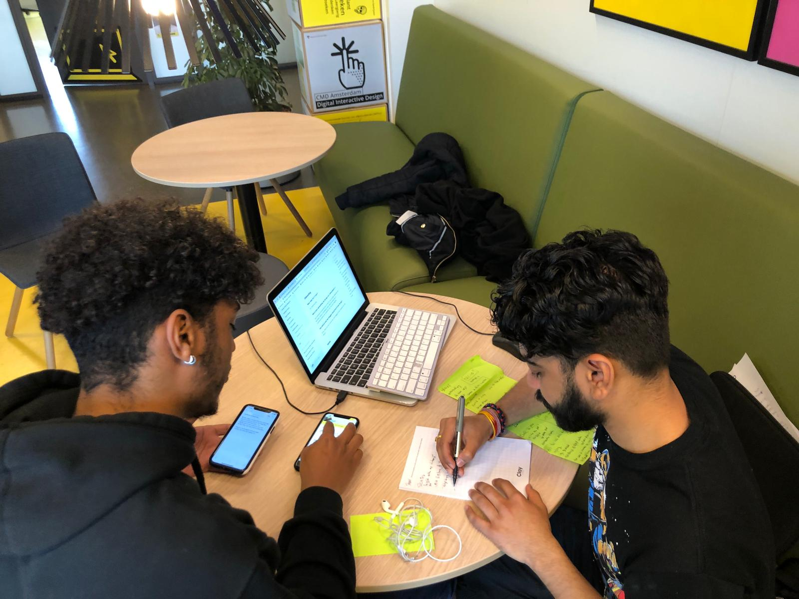

# Sharief Toussaint

## Onboarding

### Algemene punten over deze flow/pagina

-

### Waar staat SLC-O voor?

-SLC Onderwijs

### Wat is jouw verwachting van de app o.b.v introscherm?

-Een tool om te communiceren met je SLC'er.

### Hoe denk je over het inloggen met je HvA ID voor de app?

-Makkelijk om te gebruiken

## Home

### Algemene punten over deze flow/pagina

-Als ik op Tony of Harold klik kom ik dan op hun pagina's terecht? Ik denk dit omdat ze onderstreept zijn

-Misschien in de titel een cijfer toevoegen van het aantal huidige doelen. Bij voltooide doelen wil ik ook zien hoeveel ik er al voltooid hebt.

### Wat is het hoofddoel van deze pagina?

-Het hoofddoel is om gesprekken aan te vragen en doelen bij te houden. 

### Gesprek aanvragen

#### Wat wordt er bedoelt met "je volgende afspraak...ingepland" ?

-

#### Wat verwacht je wanneer je klikt op gesprek aanvragen?

-Dat je op een pagina komt waar je dat kan aanvragen. Maar ik zou eerder zeggen dat het voorstel is.

### Jouw doelen

#### Wat is er mogelijk in de sectie "jouw doelen" ?

-Ik zie mijn eigen doelen. 

#### Hoe zou je een nieuw doel toevoegen?

-Door te klikken op het gele icoon met het plus.

#### Wat verwacht je als je op het gele icoon met plusje klikt?

-

#### Hoe zou het doelen toevoegen proces voor jou idealiter gaan?

-Door ze gemakkelijk kunnen te typen of misschien op een manier voorgekauwd krijgen.

#### Wat betekenen de kleuren bij de "jouw doelen" sectie?

-Rood is al verstreken en voor de groene doelen heb je nog de tijd om ze te doen.

### Harold Konickx

#### Wat zie je gebeuren/wat is er mogelijk in deze sectie?

-Harold is mijn slc'er. 

#### Wat verwacht je als je op "neem contact op" zou drukken?

-Een pagina met de contactgegevens van Harold.

#### Welke contact gegevens verwacht je?

* Alles wat op moodle te vinden is maar dan sneller

## Mijn doelen 

### Algemene punten over deze flow/pagina

-

**Wat houdt de doelen 2e jaar in?**

**-**Hier kan je doelen toevoegen. Alleen worden de teksten niet geformuleerd als doelen. Ik zou het eerder aanbevolen doelen noemen.

**Wat houdt de sectie CMD doelen in?**

**-**Je kan doelen van andere jaren bekijken en toevoegen. Het filter systeem is wel verwarrend.

## Mijn SLC'er

### Algemene punten over deze flow/pagina

-Wifi logo bij contactgegevens past niet echt.

-Misschien is dit ook meer een "SLC pagina" omdat je ook hier het gesprek voorstelt  en niet alleen op de hoogte bent van je slc'er.

-Misschien interessant om link te kunnen leggen met je ouder slc'er?

#### Zou je nog op een andere manier contact willen opnemen met je SLC'er?

-Bellen, appen en mail is voldoende.

## Gesprek aanvragen

### Algemene punten over deze flow/pagina

-Hoe kan ik reactie terug ontvangen. Komt dit op de slc'ers pagina?

-

### Onderwerp

#### Wat vind je van de beschikbare onderwerpen?

-Duidelijk genoeg om te weten waar je behoefte aan hebt.

#### Zijn onderwerpen die je zou kunnen samen voegen of toevoegen?

-Nee

#### Heeft de tagline onderaan het onderwerp waarde?

-Ik denk dat het nog wel duidelijker kan met betere woorden. 

#### Weet je hoeveel stappen je nog moet ondernemen voordat je klaar bent?

-3 stappen door de bolletjes.

### Context

#### Wat kan je doen op deze pagina?

-Hier kan je tekst uittypen en bijlage mee sturen. Ik weet alleen niet hoeveel ik moet typen of kwijt moet. Ik wil  geen dagboek schrijven maar wel duidelijk zijn.

#### Is het duidelijk wat je kan uploaden?

-Daar kom je achter als je klikt. Het is voor de hand liggender als je bijlage kan doorsturen naar een vak docent.

#### Hoeveel waarde geeft de voorbeeld zin mee?

-Heeft in deze situatie geen waarde

#### Is er iets wat mist op deze pagina?

-Nada

### Wanneer

#### Wat kan je doen op deze pagina?

-Datum meegeven

#### Is er iets wat mist op deze pagina?

-Ik denk dat je met een kalander veel duidelijker kan aangeven wanneer jij zou kunnen. Misschien kan je bijv 3 data's kiezen zodat de SLC'er makkelijker kan kiezen.

-Verder een tijd meenemen hoe lang je ongeveer wilt praten lijkt me ook heel handig.

-Is het niet mogelijk om beschikbare tijden van de SLC'er te zien?

-Datum en maand

## Overige vragen/opmerkingen

-Herinneringen pagina ben ik benieuwd naar.

-Een afspraken pagina waar je misschien de geschiedenis kan zien wanneer de CMD’er en slc’er hebben afgesproken. Of dat als een student een aanvraag heeft gedaan het daar dan binnenkomt.

## Zou je SLC-O liever als een app of een website willen gebruiken en waarom?

-App voelt kort en bondig aan. Toegankelijker. Verder zou ik niet vaak de website bezoeken omdat de website opzoeken en intypen een drempel gaat zijn. Het is niet makkelijk. 

## Inzichten

* @onboarding; Nog duidelijker aangeven dat SLC-O staat voor ondersteuning
* @Home;  Hier zijn er wat verbeterpunten die het concept verder helpen!
* @Mijn SLC'er; Het is interessant om het meer te zien als een SLC pagina ipv slc'er pagina.
  * Dus door misschien een geschiedenis te zien van de laatste data wanneer de student en slc'er hebben afgesproken. Of dat als een student een aanvraag heeft gedaan het daar dan binnenkomt.
* @Doelenpagina; Hier valt veel te winnen door duidelijker aan te geven wat er mogelijk is. 
* @Gesprekaanvraag; Over het algemeen valt er genoeg te verbeteren met het aangeven wanneer de student een afspraak wilt maken en hoe deze kan reageren hierop.

