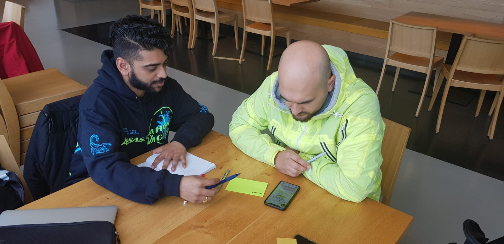

# Berat

## Feedback concept 

* Ik snap deels wat de app doet maar deels ook niet. Dit komt vooral omdat het nogal veel mogelijkheden heeft. Daarom denk ik meteen aan een nieuwere moodle. Daarnaast heeft het overeenkomsten met de HvA app en zou je veel functies  van deze app kunnen verwerken in de HvA app.

### Ideeën & kansen 

* -

## In 1 zin‌ 

"Een digitale webapp redesign van Moodle"‌‌

## Feedback prototype 

### CMD'er versie 

#### Onboarding 

* Ik ben bekend met HvA ID dus dat is makkelijk

#### Home 

* Het is een samenstelling van meerdere dingen. Daardoor weet ik minder goed wat het hoofddoel is van de app. 

#### Afspraken pagina‌ 

* Misschien kan je jouw agenda koppelen met afspraken zodat je die daarin kan zien. Ik zou de optie willen hebben om aan te geven dat de HvA niet kan zien dat ik 5 afspraken heb gehad over persoonlijke omstandigheden.

#### Afspraken aanvragen 

* Ik vind het handiger als je tijds indicatie kan geven van bijv 20-40 minuten dan strakker 25 minuten aan te houden. 
* Ik mis voor nu geen onderwerpen maar ben van mening dat het een moment opname is. Dus na testen of realisatie weet je pas of je iets mist.
* Goede onderwerpen

#### Doelen 

* Eigenlijk wil ik dat je in het 2e jaar kan voorbereiden op je minor en niet in je derde jaar pas. Dus hoe je de doelen communiceert is belangrijk en wanneer ze relevant zijn. 

#### Mijn SLC'er 

* Handig

**Herinneringen**‌‌

* Goede functie
* Ik mis een soort algemene CMD meldingen of staat die al aan? Iets wat je van te voren meldingen geeft wanneer je iets moet doen. \(Laat voorbeeld zien; Mail Justus met een deadline over 2,5 week. \)
* Duidelijk dat je herinneringen krijgt maar ik zou met een informatie knop goed aangeven waarom je die bovenste herinneringen niet kan uitzetten.
* Bij optionele herinneringen zou je nog trips of sociale activiteiten herinneringen kunnen toevoegen. Dat vind ik persoonlijk wel boeiend.

### SLC'er versie 

* Ik ga er niet echt over omdat het niet voor mij is maar ziet er prima uit 

