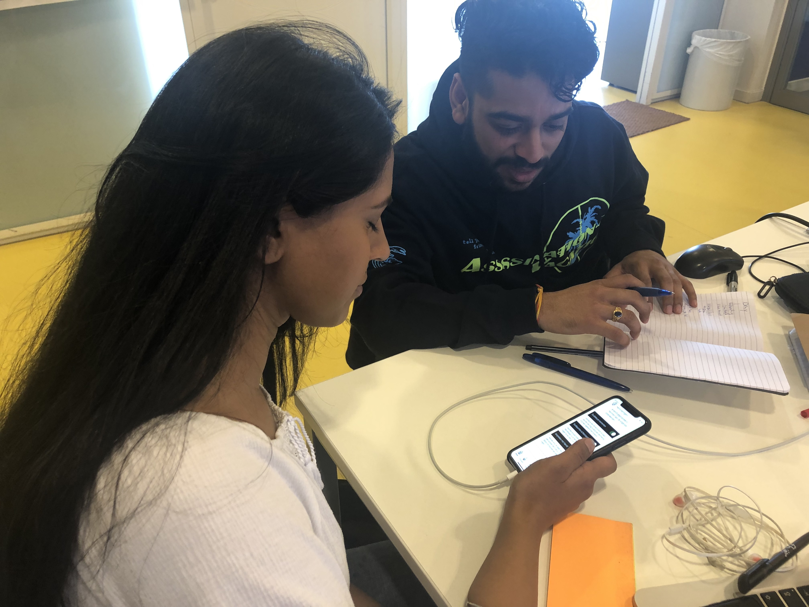

# Dewy Soekhoe

## Feedback concept 

* Het is een praktisch en makkelijk concept voor zowel de slc'er als cmd'er. Heel veel is mogelijk maar niks is verplicht.

‌

### Ideeën & kansen 

* Visueel misschien meer experimenteren

‌

### Notities 

* -

## In 1 zin‌ 

"Een app zowel desktop & mobiel voor zowel de SLC'er als CMD'er benaderen voor afspraken, vragen en doelen besprekingen"‌

## Feedback prototype 

### CMD'er versie 

#### Onboarding 

* Duidelijk en bekende onboarding
* Leuke animatie met de overgang naar de app!‌

#### Home 

* Visueel gezien vind ik lichtgeel en grijs niet passen bij elkaar
  * Misschien dat blauw beter zou passen ivp geel
  * Let even op hoe je gebruikt maakt van underline, bold en italic en waar je de gebruikers focus op wilt leggen.
    * Tony krijgt focus, wil je dat?
    * Harold is mijn slc'er dus moet hij wel gehiglight worden?
  * Buttons vind ik niet mooi
* Functioneel gezien is het duidelijk wat je kan doen en hoe je dat kan doen

#### Afspraken pagina 

* Niks op aan te merken!

#### Afspraken maken 

* Duidelijke onderwerpen en ziet er goed uit.
* Goed idee om aanvragen te doen

#### Doelen 

* Misschien bij het doel invullen de input fields wit maken ivp zwart 
* Voor de rest het heel handig voor de studenten om doelen makkelijk toe te voegen.
* De stappen maken per doel is goed.

#### Mijn SLC'er 

* Lijntje onder Harold voegt niks toe, dus zou je weg kunnen halen!
* Slim om het rooster van je slc'er te zien.

**Herinneringen**‌

* Ik denk dat je de belangrijkste herinneringen goed covert.
  * Misschien dat je als slc'er ook herinneringen kan uitsturen voor bijv blok enquetes of andere zaken.

### SLC'er versie 

* Misschien bij het filteren op studiepunten een betere sliders of dat je gewoon kan intypen.

