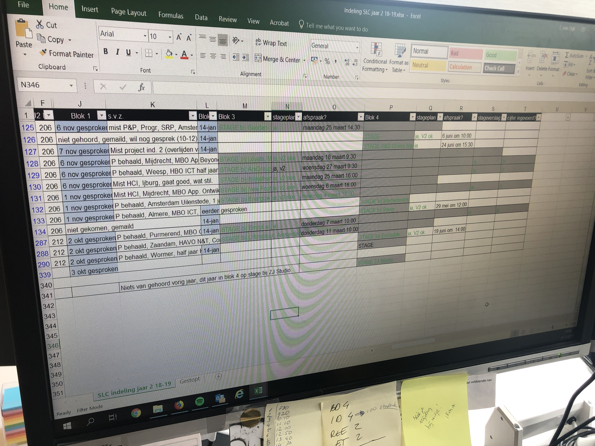

# Leonie van Dijk

## Feedback Concept

### Idee

* Leonie: "Ik zie het wel zitten!" 
* SLC op zich mist bepaalde richtlijnen wat er voor zorgt dat slc'er hun eigen manier gebruiken. Er zijn inderdaad teveel studenten die nogal in rondjes zwemmen en niet goed weten wat ze moeten met SLC.
  * Deze app kan een richtlijn zijn voor zowel studenten als docenten.  
* Het is nuttig en praktisch idee. 
* Leonie vind het een interessant en goed idee om het werk voor de slc'er makkelijker te maken door studenten te laten nadenken over waarom ze contact willen. 
* Voor afspraken raad Leonie aan om meer te denken aan een soort datumprikker waar de student kan kiezen voor meerdere datums en dan minimaal 3 opties meegeeft in de aanvraag naar de SLC'er.

### Probleem

* Leonie kan zich goed vinden in het probleem dat studenten zich verloren kunnen voelen.
  * Er was een student die een SLC'er had die haar niet begeleide. Waarschijnlijk kwam dit omdat de SLC'er niet wist hoe het met haar ging. De studente wist naar waar ze moest beginnen en vroeg of Leonie haar SLC'er kon zijn.
  * De SLC'er kan dus studenten uit het oog verliezen. Leonie kon dat hiermee bevestigen. 
* Leonie kan daarnaast bevestigen dat er inderdaad studenten zijn die soms laat of niet reacties krijgen van bepaalde SLC'er.
  * Leonie verteld dat zij soms niet meteen kan reageren maar wel haar best doet om zo snel mogelijk te reageren.
    * Ze vindt het ook helemaal niet fijn als het haar niet lukt.
  * Leonie heeft een enorme benaderbare houding naar studenten toe
    * Ze vertelt altijd aan haar studenten dat ze haar altijd kunnen bereiken via mail, telefoon en door simpelweg langs te komen. 

### Product

* Heel goed dat de SLC'er foto's ziet van haar studenten
  * Zo zijn ze herkenbaarder
  * Leonie houd nu alles handmatig bij en dat kost haar nogal wat tijd
    * Als dat makkelijker kan is dat alleen maar goed. 
* Visueel heel sterk, ziet er duidelijk uit om te gebruiken 
* Leonie heeft de voorkeur voor een desktop versie omdat zij het werken met vergelijkbare producten  fijner vind werken op de desktop. Zoals onstage.
  * Werken op de app geeft haar een "vluchtig/haastig gevoel"

### SLC-O in 1 zin volgens Leonie:

"Een tool om studenten en slc'ers te ondersteunen en inzicht en overzicht te geven over hun studie & opgestelde doelen."

### Manier van werken

* Persoonsgegevens zijn verstopt
* Laatst gesproken \| Gesprek punten \| Stage plan en stagebedrijven
* Overzicht van netwerk voor stage
* Moodle is vervelend en kost te veel stappen om afspraken te maken -&gt; Leonie kiest erover om via google drive afspraken met hun slc'er omdat dat makkelijker gaat.

## Ideeën

* Is het geen idee om bijv per blok een standaard gesprek te hebben en dat de vrijblijvende gesprekken optioneel zijn?
* SLC-O zou goed kunnen figureren als lerend systeem. Dus wanneer een student minder studiepunt heeft dan gemiddeld in zijn jaar, dan krijgt hij/zij meer doelen te zien over herkansingen.
* Criteria van stappen die je als student voor iets moet doen zoals onstage, verwerken in de app
* Hoe zou je nog kunnen reflecteren op je leerdoelen.

## Volgende stappen

* ~~Bij Leonie langsgaan om te zien hoe zij te werk gaat~~
* ~~Barbara spreekt met langstudeerders om samen te bespreken hoe zij hun studie kunnen halen of hoe ze alles nu op de rit kunnen krijgen.~~
  * ~~"Ik zou Barbara zeker even aanspreken"~~
* Wie zou ik nog moeten spreken?
  * Annette
  * Eva
  * Marc
  * Laura
  * Barbara

