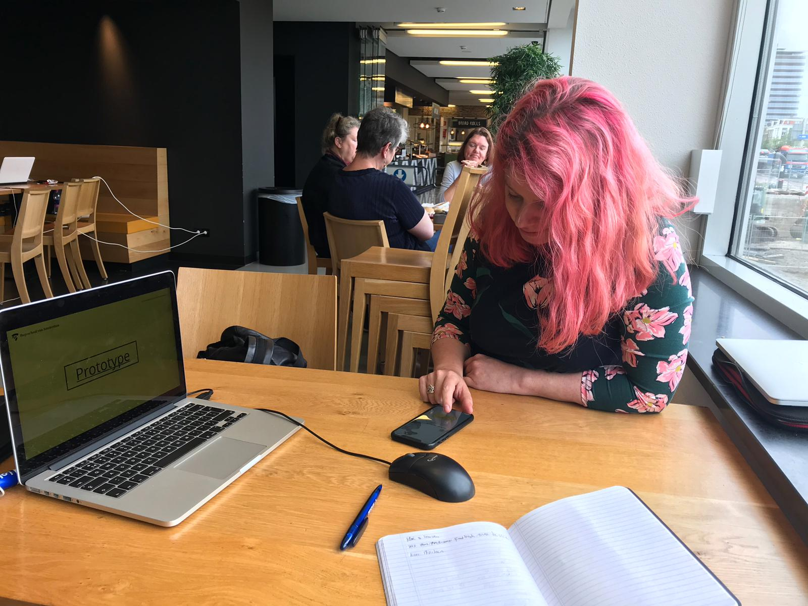

# Anne-Marleen Olthof

## Feedback concept 

* Hele duidelijke manier om de student opweg te helpen
* Het ziet er goed uit
* Ik houd ervan hoe de app staat voor een duidelijke aanpak
* Overzicht van doelen is heel handig en bruikbaar voor de studenten.
* Het is positief dat cmd'ers in een positieve positie staan maar dat de SLC'ers ook weten wat zouden kunnen doen.

### Ideeen & kansen

* Vaste canvassen/templates die studenten kunnen invullen ter voorbereiding op een afspraak.
  * Of studieplan
  * Herkansing plannen/aanpakken
* Interessant om te onderzoeken/kijken \(na afstuderen\) hoe je om kan gaan met docenten die niet zo betrokken zijn met SLC. Waarom ze zo een houding hebben etc.

## In 1 zin 

"Een tool om je persoonlijke leerroute te managen"

## Feedback prototype 

### CMD'er versie 

#### Onboarding 

* -

#### Home 

* Ik snap dat 4 dagen handig is als tijd indicatie maar misschien is de tijd zelf slimmer of handiger.

#### Afspraken pagina 

* Handig dat je kan terug kijken wanneer je afspraken waren
* Ik ben benieuwd naar hoe je meegestuurde context eruit ziet
  * Dat zou ik nog wel uitwerken

#### Afspraken maken 

* Ziet er heel compleet uit
* Heel handig dat je de SLC'er kan laten voorbereiden
  * Uit eigen ervaring vind ik het inderdaad een probleem dat studenten zichzelf niet goed voorbereiden wat dus ons, de slc'er meer tijd kost. Dat is niet erg maar het kan slimmer.
* Wanneer een student kies voor persoonlijke omstandigheden dan zou de student ook moeten weten dat je meteen naar de decaan kan gaan
* Ik vind YES! beetje raar als je wilt afspreken over persoonlijke omstandigheden.

#### Doelen 

* Doelen pagina is heel handig en bruikbaar voor de cmd'er.
* Het geeft een bepaalde houvast voor cmd'er zodat die weet waar hij of zij moet beginnen.

#### Mijn SLC'er 

* Ik weet niet of ik al mijn gegevens hier zou willen hebben maar zou het eerst zo laten. Dus dat de CMD'ers mij wel kunnen bellen, appen of mailen. Mocht het "teveel" gebruikt worden dan zou ik het willen uitzetten/verbergen.
  * Voorkeur is bij mailen.

**Herinneringen**

* Ziet er prima uit. Misschien zou je nog een soort algemene CMD herinneringen kunnen krijgen.
* Ik heb ook niet het idee dat je iets verder mist.

### SLC'er versie 

* Ziet er handig en fijn uit
  * Vooral het overzicht op de studenten
* Ik maak zelf geen gebruik van excel of een eigen overzicht
* Het zou handig zijn als je een afspraak kan maken als docent met meerdere studenten wanneer die studenten beide met iets zitten wat ze gemeen hebben. Dit is dan efficiënter om gezamenlijk af te spreken.

