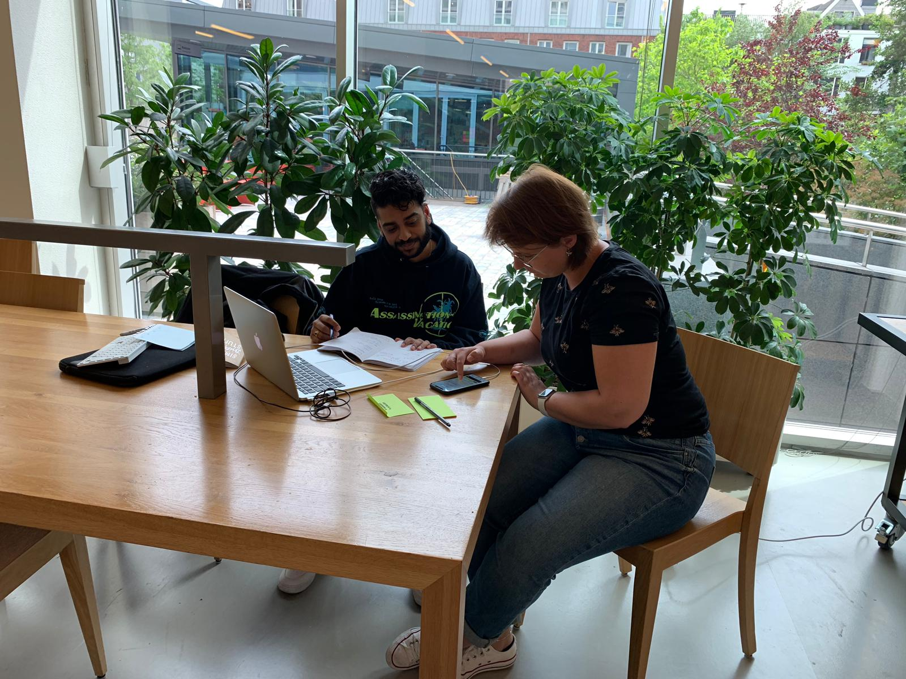

# Miranda Endhoven

## Feedback concept 

* Het is heel tof dat je slc'ers helpt met het motiveren en prikkelen om CMD'ers te helpen of tenminste vaker te kijken hoe het met hun gaat
* Het ziet er goed uit.
* Het is makkelijk te gebruiken voor zowel de slc'er als cmd'er.
* Herinneringen zijn fijn voor beide partijen

### Ideeën & kansen

* Onderin genoemd: Algemene vaardigheden toevoegen bij doelen.
  * SRP punten/doelen meenemen in het proces

### Notities

* "Elkaar vaker zien zorgt voor een beter band!"
* "Ik vind dat SLC'ers van het eerste jaar hun SLC klas in alle mogelijke vakken ook les geven. Zo leer je, je studenten beter kennen en bouw je een betere band op."
* Vision bord gemaakt met als doel om je doel voor 2019 in kaart te brengen
  * Studenten praten er nog steeds over.
  * Positief ontvangen!
* "Voor een professionalisering punt heb ik mijn studenten een curcus gegeven in productiviteit over plannen, geconcentreerd werken en jezelf beter leren kennen op dat gebied. "

## In 1 zin 

"Een app om het contact makkelijker te maken tussen SLC'er en CMD'er en dat het gebruik van andere tools zoals moodle, mail, sis en whatsapp verminderd."

## Feedback prototype 

### CMD'er versie 

#### Onboarding 

* -

#### Home 

* Ziet er logisch uit als de samenstelling van je app.

#### Afspraken pagina 

* -

#### Afspraken maken 

* Bijkletsen wordt meestal ook gedaan naast SLC. Weet niet of het perse SLC is maar ik snap dat je het laagdrempelig wilt maken om gesprekken aan te vragen.

#### Doelen 

* Doelen pagina vind ik heel goed
* Het maakt het inzichtelijk voor de cmd'er wat hij of zij zou kunnen oppakken
* Wat ik nog mis is een aparte kaart/pagina/stuk over professionele skills zoals plannen, presenteren, organiseren etc. En dat studenten dat ook kunnen toevoegen aan hun doelen. Soort van algemene vaardigheden.

#### Mijn SLC'er 

* Niks op aan te merken, ziet er heel praktisch uit en voor de hand liggend

**Herinneringen**

* Ik denk dat je de belangrijkste herinneringen goed covert. 
  * Misschien dat je als slc'er ook herinneringen kan uitsturen voor bijv blok enquetes of andere zaken.

### SLC'er versie 

* Misschien kan je laten zien of een student een vak niet heeft gehaald?
* Studiepunten aantal klopt niet en zou bijv beter kunnen dmv per jaar.

