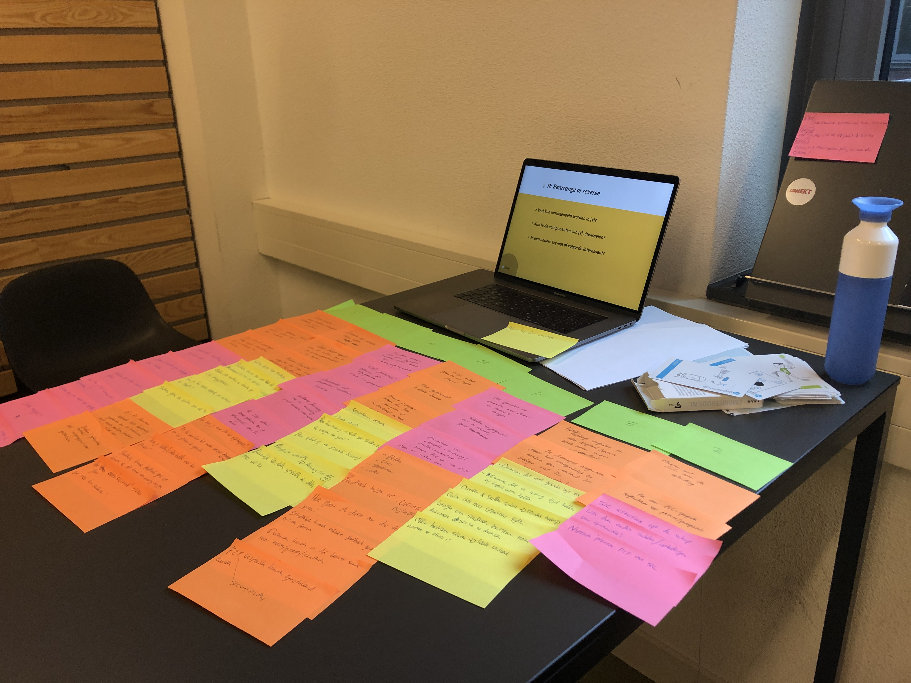
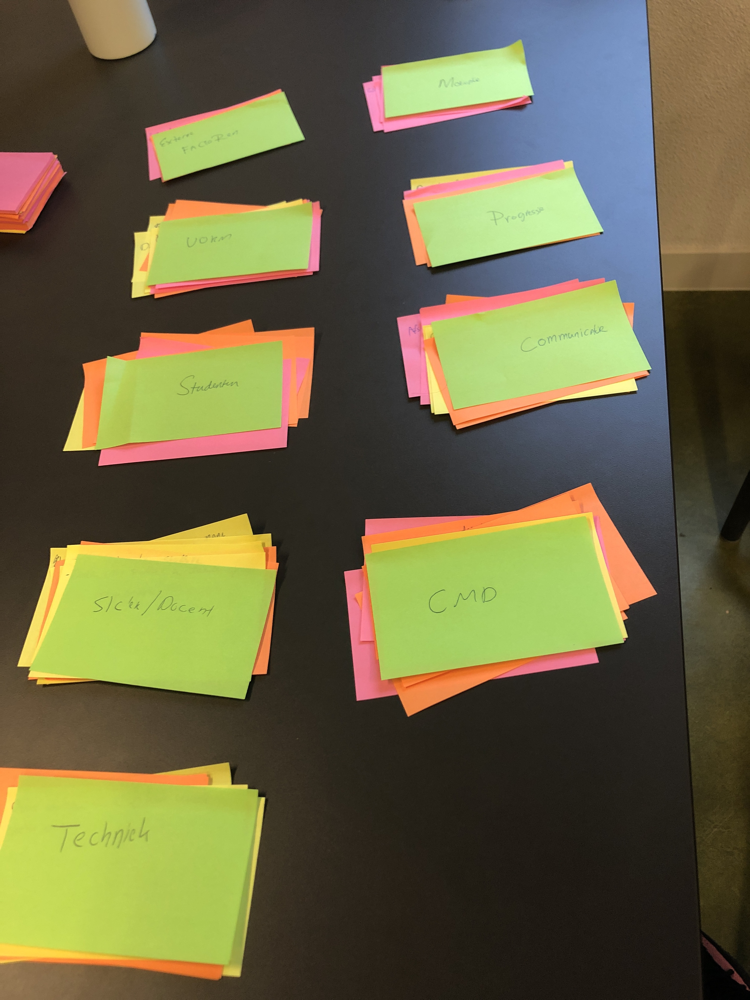

# S.C.A.M.P.E.R

## Wat is de S.C.A.M.P.E.R methode?

Op donderdag 28 maart heb ik een S.C.A.M.P.E.R sessie gehouden met Bart van Dongen. S.C.A.M.P.E.R is een _acroniem_ voor: _Selecting, Combining, Adapting, Modifying, Put to different uses, Eliminating and Reversing._ Deze methodes is bedoelt om op basis van je probleem/oplossing, doelgroep en context ideeën te genereren om er vervolgens weer op door te itereren.

Het is een brainstorm techniek die mij enorm beviel om te gebruiken in de beginfase van mijn product ontwikkeling. Per letter \(onderdeel\) stel je vragen omtrent jouw probleem/oplossing/dienst/product. Wij maakte gebruik van de volgende voorbeeld vragen:

#### Substitute – plaatsvervanging

* Welke materialen of middelen kunnen worden vervangen om het product te verbeteren?
* Welk ander product kan gebruikt worden?
* Welke onderdelen kunnen worden vervangen?
* Is het product ook voor een andere toepassing te gebruiken?

#### Combine – combineren

* Wat gebeurt er als het product gecombineerd wordt met een ander product? Ontstaat er dan een nieuw eindproduct?
* Kan het product ook voor een ander doel gebruikt worden?
* Met wat kan het product gecombineerd worden, zodat het gebruik van het product gemaximaliseerd wordt?

#### Adapt – aanpassen

* Kan dit product worden aanpassen, zodat het tot een ander gebruik dient?
* In welke andere context kan het product geplaats worden?
* Hoe kan het product worden aangepast, zodat het een nog betere functie krijgt?

#### Modify/ Magnify – wijzigingen

* Hoe zou de vorm of het uiterlijk van het product veranderd kunnen worden?
* Wat kan aan het product worden toegevoegd?
* Wat zou aan het product benadrukt kunnen worden om zo meer waarde te creëren?
* Welk onderdeel van het product kan veranderd worden, zodat er iets nieuws ontstaat?

#### Purpose – voor een ander gebruik inzetten

* Kan het product voor iets anders worden gebruikt?
* Door wie zou dit product nog meer kunnen worden gebruikt?
* Hoe zou dit product zich gedragen in een andere context?
* Kan het afval van dit product worden hergebruikt?

#### Eliminate/ Minify – elimineren / weglaten

* Hoe zou dit product eruit zien als het vereenvoudigd wordt?
* Welke functies en/of onderdelen kunnen worden weggelaten?
* Hoe kan het product kleiner, sneller of lichter gemaakt worden?
* Wat zou er gebeuren als een deel van het product wordt weggehaald?

#### Rearrange/ Reverse – omgekeerde

* Wat gebeurt er als het product wordt omgedraaid?
* Wat gebeurt er als onderdelen van het product in een andere volgorde worden gemonteerd?

Per onderdeel schreven wij onze ideeën op post-its in max 5 minuten. Het is de bedoeling dat je allerlei gedachtes/ideeën "gewoon" opschrijft. Niks kan meteen worden afgekeurd. Vervolgens werden de post-its geplakt onder het onderdeel. 

Deze inzichten werden vervolgens samen gevoegd. We keken goed welke post-its bij elkaar passen of relevant aan elkaar waren. Op deze manier konden we de inzichten makkelijk en duidelijk sorteren.

## De inzichten

### CMD

* Offerte vragen bij digital design/tech bureaus voor het realiseren van het product
* Boeken/artikelen gebruiken als uitgangspunt voor gesprekken
* Hoe zorg je ervoor dat het tijdbesparend wordt voor CMD?
* SLC structuur op de schop
* Customer Journey ontwerpen &gt; Zelf inrichten vormgeving van je eigen loopbaan binnen het product
* Starten met SLC voor de opleiding
* "CMD-Procesboek" gebruiken als uitgangspunt &gt; zien van progressie
* Doelen directer koppelen met de vakken om zo de inhoud persoonlijker te maken.

### Communicatie

* SLC "Spreekuur" \(Online\) waarin iedereen vrij is om te praten met de SLC'er
* Online chat met spreekuurtijden van de SLC'er die hij of zij zelf kan instellen
* Feedback geven/krijgen op vragen of bijlages
* Hoe kan je F2F communicatie stimuleren?
* Afspraken plannen voor F2F afspraken

### Externe factoren

* Ouders/vrienden/mede-studenten/klasgenoten betrekken in het platform
* Wat doen andere scholen/opleidingen voor communicatie
* Hoe kan de decaan of andere betrokken eventueel gebruikmaken of toegang krijgen tot het product

### Motivatie

* SLC moet duidelijk zijn voor studenten & docenten
* Betere verwachtingen scheppen voor beide partijen
* Wanneer ben je als student echt geholpen?
* Stimuleren van praktijk-ervaring/ondernemerschap binnen SLC
* Wat willen studenten eruit halen?

### Progressie

* Tijdens een SLC -gesprek reflecteren op proces/progressie student/SLC'er
* Studenten & SLC'er samen SLC laten vormgeven ivp de standaard methode doorlopen
* Inspelen op progressie van de student en groei benadrukken
* Persoonlijke leerdoelen opstellen en delen met SLC'er

### Studenten

* SLC gebruiken om studenten makkelijker met elkaar in contact te laten komen
* Studenten kunnen elkaar feedback geven op bijv een forum
* Studenten kunnen elkaar advies geven
* Studenten kunnen ook mede-studenten advies geven en elkaar coachen ivp SLC'er
* Studenten koppelen die tegen dezelfde problemen \(bijv faal angst\) aanlopen, kan ook ex studenten zijn of andere jaren
* Studenten die dezelfde doelen hebben, te koppelen met elkaar
* Studenten geven een voorkeur aan sLC'er
* Studenten kunnen docenten een review geven

### SLC'er/Docent

* Doelen van studenten en docenten op 1 lijn brengen of met elkaar matchen
* SLC'er kiest zijn of haar studenten
* Hoe gaan de succesvollere SLC'ers om met hun studenten?
* Waar liggen de grenzen van de SLC'ers om gebruik te maken van het product?
* Studenten kunnen de achtergrond/specialiteit zien van de SLC'er
* Docenten die niet "geschikt" zijn als coach of niet willen kunnen dit aangeven
* Docenten die te weinig tijd hebben of beperkte uren kunnen dit in het product aangeven
* SLC'ers kunnen 1 bericht naar meerdere mensen/groepen/studenten/collega's sturen
* SLC'ers kunnen vragen doorsturen
* SLC'ers kunnen herinneringen instellen om te controleren hoe het gaat met de student

### Techniek

* Offline berichten sturen -&gt; Wordt verstuurd wanneer er internet is
* Voice memo's gebruiken als lagere drempel 
* Chat functionaliteit in Moodle bouwen
* Bellen/Videobellen met het product
* Hoe kan de data mee door de jaren heen?
* Spraakmemos versturen
* Wi-FI Beacons netwerk HvA herkenning gebruiken om te herkennen dat beide partijen \(SLC'er en student\) op school aanwezig zijn.
* Systeem koppelen met brightspace of Moodle?

### Vorm

* Het verschil met Slack, mail en whatsapp moet duidelijk zijn in de vorm
* Facebook groepen die voor bepaalde specifieke doelen opgezet zijn \(Mensen met dezelfde problemen bijv\)
* Dashboard met progressie/statistieken/inzichten
* Het product is per opleiding verschillend van huisstijl. Deze komt namelijk van de studie.
* Fysieke meetings weghalen en alles digitaal \(Online plaats laten vinden voor videochat\)
* De drempel wegnemen door het toegankelijk te maken om contact te krijgen met SLC, kijken naar Social media?
* Bellen
* Chat
* Spraakmemo's
* Videobellen
* Dark mode \(beter voor de ogen in de avond\)
* Zijn er verschillende tussen "de app" en website versie?
* De CMD method cards gebruiken om de opleiding/SLC vorm te geven

