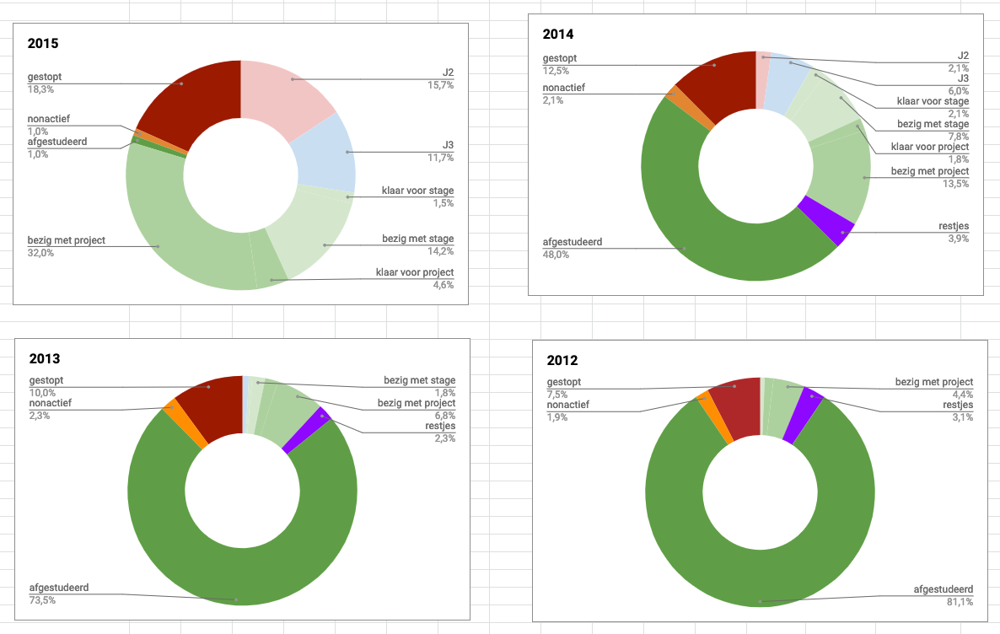

# Studenten Data

## Hieronder is te zien wat de studenten uit hun startjaar, aan het doen zijn.

Ik ben begonnen in studiejaar 2015. Van elke CMD'er die dat jaar was begonnen met de studie, studeert er nu 32% af. Een groot gedeelte lopen achter door omstandigheden. Door met studenten die achterstand te praten kreeg ik verschillende inzichten.

Mijn grootste inzicht die ik eruit heb gehaald is dat studenten makkelijker contact leggen en behouden met hun SLC'er. Samen met de SLC'er kan de CMD-er beter zijn studie doorheen gaan. Om dit te bevestigen praat ik met huidige afstudeerers om te kijken of er een link zit tussen goede SLC en afstudeerbekwaam zijn.

